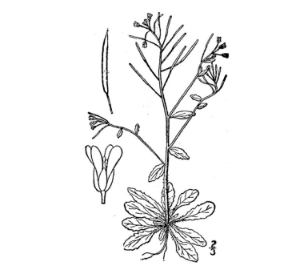
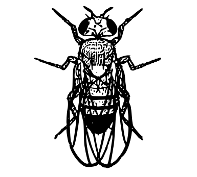
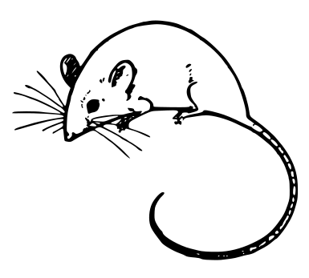
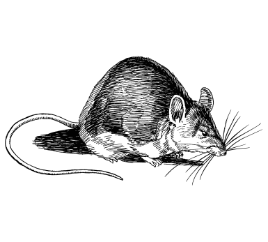

**COBIND** pipeline aims to identify the co-binders/co-factors of
transcription factors (TFs). The method uses coordinates of
transcription factor binding sites (TFBSs) as an input and returns
information about co-binders and their binding fashion — spacings
between the two binding sites.

This repository and its contents were used to produce the results for
the COBIND manuscript. We made available COBIND as a tool, which can be
found [here](https://bitbucket.org/CBGR/cobind_tool/src/master/).

## What to expect from this page?

This page contains results from COBIND 2022 analysis. We analysed 8,792
datasets of high-confidence TFBSs stored in [UniBind
2021](https://unibind.uio.no/) database for 404 unique TFs that
collectively are from 7 species: *Arabidopsis thaliana*, *Caenorhabditis
elegans*, *Danio rerio*, *Drosophila melanogaster*, *Homo sapiens*, *Mus
musculus* and *Rattus norvegicus*.

Reports about discovered co-binders are provided for each TF (where at
least one co-binder was discovered) in different species. Another group
of reports report the discovered co-binders summarized over TF families.

# **Arabidopsis thaliana**

</img>

<b>Results for individual TFs</b>

<a href='COBIND_results/individual/ARABIDOPSIS_0.99/reports/ABF1/COBIND_analysis_report_ABF1.html'>ABF1</a>

<a href='COBIND_results/individual/ARABIDOPSIS_0.99/reports/ABF3/COBIND_analysis_report_ABF3.html'>ABF3</a>

<a href='COBIND_results/individual/ARABIDOPSIS_0.99/reports/ABF4/COBIND_analysis_report_ABF4.html'>ABF4</a>

<a href='COBIND_results/individual/ARABIDOPSIS_0.99/reports/ATHB7/COBIND_analysis_report_ATHB7.html'>ATHB7</a>

<a href='COBIND_results/individual/ARABIDOPSIS_0.99/reports/GBF2/COBIND_analysis_report_GBF2.html'>GBF2</a>

<a href='COBIND_results/individual/ARABIDOPSIS_0.99/reports/GBF3/COBIND_analysis_report_GBF3.html'>GBF3</a>

<a href='COBIND_results/individual/ARABIDOPSIS_0.99/reports/HAT22/COBIND_analysis_report_HAT22.html'>HAT22</a>

<a href='COBIND_results/individual/ARABIDOPSIS_0.99/reports/HY5/COBIND_analysis_report_HY5.html'>HY5</a>

<a href='COBIND_results/individual/ARABIDOPSIS_0.99/reports/KAN1/COBIND_analysis_report_KAN1.html'>KAN1</a>

<a href='COBIND_results/individual/ARABIDOPSIS_0.99/reports/WRKY18/COBIND_analysis_report_WRKY18.html'>WRKY18</a>

<a href='COBIND_results/individual/ARABIDOPSIS_0.99/reports/WRKY33/COBIND_analysis_report_WRKY33.html'>WRKY33</a>

<a href='COBIND_results/individual/ARABIDOPSIS_0.99/reports/WRKY40/COBIND_analysis_report_WRKY40.html'>WRKY40</a>

<b>Results for TF families</b>

# **Caenorhabditis elegans**

</img>

<b>Results for individual TFs</b>

<a href='COBIND_results/individual/CELEGANS_0.99/reports/EFL-1/COBIND_analysis_report_EFL-1.html'>EFL-1</a>

<a href='COBIND_results/individual/CELEGANS_0.99/reports/PHA-4/COBIND_analysis_report_PHA-4.html'>PHA-4</a>

<b>Results for TF families</b>

# **Danio rerio**

</img>

<b>Results for individual TFs</b>

<a href='COBIND_results/individual/DRERIO_0.99/reports/CTCF/COBIND_analysis_report_CTCF.html'>CTCF</a>

<b>Results for TF families</b>

# **Drosophila melanogaster**

</img>

<b>Results for individual TFs</b>

<a href='COBIND_results/individual/DROSOPHILA_0.99/reports/BEAF-32/COBIND_analysis_report_BEAF-32.html'>BEAF-32</a>

<a href='COBIND_results/individual/DROSOPHILA_0.99/reports/CLAMP/COBIND_analysis_report_CLAMP.html'>CLAMP</a>

<a href='COBIND_results/individual/DROSOPHILA_0.99/reports/CTCF/COBIND_analysis_report_CTCF.html'>CTCF</a>

<a href='COBIND_results/individual/DROSOPHILA_0.99/reports/GRH/COBIND_analysis_report_GRH.html'>GRH</a>

<a href='COBIND_results/individual/DROSOPHILA_0.99/reports/GT/COBIND_analysis_report_GT.html'>GT</a>

<a href='COBIND_results/individual/DROSOPHILA_0.99/reports/HSF/COBIND_analysis_report_HSF.html'>HSF</a>

<a href='COBIND_results/individual/DROSOPHILA_0.99/reports/PDP1/COBIND_analysis_report_PDP1.html'>PDP1</a>

<a href='COBIND_results/individual/DROSOPHILA_0.99/reports/PHO/COBIND_analysis_report_PHO.html'>PHO</a>

<a href='COBIND_results/individual/DROSOPHILA_0.99/reports/TRL/COBIND_analysis_report_TRL.html'>TRL</a>

<a href='COBIND_results/individual/DROSOPHILA_0.99/reports/TWI/COBIND_analysis_report_TWI.html'>TWI</a>

<b>Results for TF families</b>

# **Homo sapiens**

</img>

<b>Results for individual TFs</b>

<a href='COBIND_results/individual/HUMAN_0.99/reports/AR/COBIND_analysis_report_AR.html'>AR</a>

<a href='COBIND_results/individual/HUMAN_0.99/reports/ARNT-HIF1A/COBIND_analysis_report_ARNT-HIF1A.html'>ARNT-HIF1A</a>

<a href='COBIND_results/individual/HUMAN_0.99/reports/ARNT/COBIND_analysis_report_ARNT.html'>ARNT</a>

<a href='COBIND_results/individual/HUMAN_0.99/reports/ASCL1/COBIND_analysis_report_ASCL1.html'>ASCL1</a>

<a href='COBIND_results/individual/HUMAN_0.99/reports/ATF3/COBIND_analysis_report_ATF3.html'>ATF3</a>

<a href='COBIND_results/individual/HUMAN_0.99/reports/BACH2-VAR2/COBIND_analysis_report_BACH2-VAR2.html'>BACH2-VAR2</a>

<a href='COBIND_results/individual/HUMAN_0.99/reports/BACH2/COBIND_analysis_report_BACH2.html'>BACH2</a>

<a href='COBIND_results/individual/HUMAN_0.99/reports/BATF-JUN/COBIND_analysis_report_BATF-JUN.html'>BATF-JUN</a>

<a href='COBIND_results/individual/HUMAN_0.99/reports/BATF3/COBIND_analysis_report_BATF3.html'>BATF3</a>

<a href='COBIND_results/individual/HUMAN_0.99/reports/BCL6/COBIND_analysis_report_BCL6.html'>BCL6</a>

<a href='COBIND_results/individual/HUMAN_0.99/reports/CDX2/COBIND_analysis_report_CDX2.html'>CDX2</a>

<a href='COBIND_results/individual/HUMAN_0.99/reports/CEBPA/COBIND_analysis_report_CEBPA.html'>CEBPA</a>

<a href='COBIND_results/individual/HUMAN_0.99/reports/CREB1/COBIND_analysis_report_CREB1.html'>CREB1</a>

<a href='COBIND_results/individual/HUMAN_0.99/reports/CTCF/COBIND_analysis_report_CTCF.html'>CTCF</a>

<a href='COBIND_results/individual/HUMAN_0.99/reports/CTCFL/COBIND_analysis_report_CTCFL.html'>CTCFL</a>

<a href='COBIND_results/individual/HUMAN_0.99/reports/DDIT3-CEBPA/COBIND_analysis_report_DDIT3-CEBPA.html'>DDIT3-CEBPA</a>

<a href='COBIND_results/individual/HUMAN_0.99/reports/ERG/COBIND_analysis_report_ERG.html'>ERG</a>

<a href='COBIND_results/individual/HUMAN_0.99/reports/ESR1/COBIND_analysis_report_ESR1.html'>ESR1</a>

<a href='COBIND_results/individual/HUMAN_0.99/reports/ESRRA/COBIND_analysis_report_ESRRA.html'>ESRRA</a>

<a href='COBIND_results/individual/HUMAN_0.99/reports/ETV1/COBIND_analysis_report_ETV1.html'>ETV1</a>

<a href='COBIND_results/individual/HUMAN_0.99/reports/ETV6/COBIND_analysis_report_ETV6.html'>ETV6</a>

<a href='COBIND_results/individual/HUMAN_0.99/reports/FLI1/COBIND_analysis_report_FLI1.html'>FLI1</a>

<a href='COBIND_results/individual/HUMAN_0.99/reports/FOS-JUN/COBIND_analysis_report_FOS-JUN.html'>FOS-JUN</a>

<a href='COBIND_results/individual/HUMAN_0.99/reports/FOS-JUNB/COBIND_analysis_report_FOS-JUNB.html'>FOS-JUNB</a>

<a href='COBIND_results/individual/HUMAN_0.99/reports/FOS-JUND/COBIND_analysis_report_FOS-JUND.html'>FOS-JUND</a>

<a href='COBIND_results/individual/HUMAN_0.99/reports/FOS/COBIND_analysis_report_FOS.html'>FOS</a>

<a href='COBIND_results/individual/HUMAN_0.99/reports/FOSB-JUN/COBIND_analysis_report_FOSB-JUN.html'>FOSB-JUN</a>

<a href='COBIND_results/individual/HUMAN_0.99/reports/FOSB-JUNB/COBIND_analysis_report_FOSB-JUNB.html'>FOSB-JUNB</a>

<a href='COBIND_results/individual/HUMAN_0.99/reports/FOSL1-JUN/COBIND_analysis_report_FOSL1-JUN.html'>FOSL1-JUN</a>

<a href='COBIND_results/individual/HUMAN_0.99/reports/FOSL1-JUNB/COBIND_analysis_report_FOSL1-JUNB.html'>FOSL1-JUNB</a>

<a href='COBIND_results/individual/HUMAN_0.99/reports/FOSL1-JUND/COBIND_analysis_report_FOSL1-JUND.html'>FOSL1-JUND</a>

<a href='COBIND_results/individual/HUMAN_0.99/reports/FOSL1/COBIND_analysis_report_FOSL1.html'>FOSL1</a>

<a href='COBIND_results/individual/HUMAN_0.99/reports/FOSL2-JUN/COBIND_analysis_report_FOSL2-JUN.html'>FOSL2-JUN</a>

<a href='COBIND_results/individual/HUMAN_0.99/reports/FOSL2-JUNB/COBIND_analysis_report_FOSL2-JUNB.html'>FOSL2-JUNB</a>

<a href='COBIND_results/individual/HUMAN_0.99/reports/FOSL2-JUND/COBIND_analysis_report_FOSL2-JUND.html'>FOSL2-JUND</a>

<a href='COBIND_results/individual/HUMAN_0.99/reports/FOSL2/COBIND_analysis_report_FOSL2.html'>FOSL2</a>

<a href='COBIND_results/individual/HUMAN_0.99/reports/FOXA1/COBIND_analysis_report_FOXA1.html'>FOXA1</a>

<a href='COBIND_results/individual/HUMAN_0.99/reports/FOXA2/COBIND_analysis_report_FOXA2.html'>FOXA2</a>

<a href='COBIND_results/individual/HUMAN_0.99/reports/FOXK2/COBIND_analysis_report_FOXK2.html'>FOXK2</a>

<a href='COBIND_results/individual/HUMAN_0.99/reports/FOXP1/COBIND_analysis_report_FOXP1.html'>FOXP1</a>

<a href='COBIND_results/individual/HUMAN_0.99/reports/GABPA/COBIND_analysis_report_GABPA.html'>GABPA</a>

<a href='COBIND_results/individual/HUMAN_0.99/reports/GATA1-TAL1/COBIND_analysis_report_GATA1-TAL1.html'>GATA1-TAL1</a>

<a href='COBIND_results/individual/HUMAN_0.99/reports/GATA1/COBIND_analysis_report_GATA1.html'>GATA1</a>

<a href='COBIND_results/individual/HUMAN_0.99/reports/GATA2/COBIND_analysis_report_GATA2.html'>GATA2</a>

<a href='COBIND_results/individual/HUMAN_0.99/reports/GATA3/COBIND_analysis_report_GATA3.html'>GATA3</a>

<a href='COBIND_results/individual/HUMAN_0.99/reports/GATA4/COBIND_analysis_report_GATA4.html'>GATA4</a>

<a href='COBIND_results/individual/HUMAN_0.99/reports/GATA6/COBIND_analysis_report_GATA6.html'>GATA6</a>

<a href='COBIND_results/individual/HUMAN_0.99/reports/GLIS1/COBIND_analysis_report_GLIS1.html'>GLIS1</a>

<a href='COBIND_results/individual/HUMAN_0.99/reports/GRHL2/COBIND_analysis_report_GRHL2.html'>GRHL2</a>

<a href='COBIND_results/individual/HUMAN_0.99/reports/HAND2/COBIND_analysis_report_HAND2.html'>HAND2</a>

<a href='COBIND_results/individual/HUMAN_0.99/reports/HIF1A/COBIND_analysis_report_HIF1A.html'>HIF1A</a>

<a href='COBIND_results/individual/HUMAN_0.99/reports/HNF1A/COBIND_analysis_report_HNF1A.html'>HNF1A</a>

<a href='COBIND_results/individual/HUMAN_0.99/reports/HNF1B/COBIND_analysis_report_HNF1B.html'>HNF1B</a>

<a href='COBIND_results/individual/HUMAN_0.99/reports/HNF4A/COBIND_analysis_report_HNF4A.html'>HNF4A</a>

<a href='COBIND_results/individual/HUMAN_0.99/reports/HNF4G/COBIND_analysis_report_HNF4G.html'>HNF4G</a>

<a href='COBIND_results/individual/HUMAN_0.99/reports/HOXA9/COBIND_analysis_report_HOXA9.html'>HOXA9</a>

<a href='COBIND_results/individual/HUMAN_0.99/reports/HOXB13/COBIND_analysis_report_HOXB13.html'>HOXB13</a>

<a href='COBIND_results/individual/HUMAN_0.99/reports/HSF1/COBIND_analysis_report_HSF1.html'>HSF1</a>

<a href='COBIND_results/individual/HUMAN_0.99/reports/IRF3/COBIND_analysis_report_IRF3.html'>IRF3</a>

<a href='COBIND_results/individual/HUMAN_0.99/reports/IRF4/COBIND_analysis_report_IRF4.html'>IRF4</a>

<a href='COBIND_results/individual/HUMAN_0.99/reports/ISL1/COBIND_analysis_report_ISL1.html'>ISL1</a>

<a href='COBIND_results/individual/HUMAN_0.99/reports/JUN-JUNB/COBIND_analysis_report_JUN-JUNB.html'>JUN-JUNB</a>

<a href='COBIND_results/individual/HUMAN_0.99/reports/JUN-VAR2/COBIND_analysis_report_JUN-VAR2.html'>JUN-VAR2</a>

<a href='COBIND_results/individual/HUMAN_0.99/reports/JUN/COBIND_analysis_report_JUN.html'>JUN</a>

<a href='COBIND_results/individual/HUMAN_0.99/reports/JUNB-VAR2/COBIND_analysis_report_JUNB-VAR2.html'>JUNB-VAR2</a>

<a href='COBIND_results/individual/HUMAN_0.99/reports/JUNB/COBIND_analysis_report_JUNB.html'>JUNB</a>

<a href='COBIND_results/individual/HUMAN_0.99/reports/JUND-VAR2/COBIND_analysis_report_JUND-VAR2.html'>JUND-VAR2</a>

<a href='COBIND_results/individual/HUMAN_0.99/reports/JUND/COBIND_analysis_report_JUND.html'>JUND</a>

<a href='COBIND_results/individual/HUMAN_0.99/reports/KLF16/COBIND_analysis_report_KLF16.html'>KLF16</a>

<a href='COBIND_results/individual/HUMAN_0.99/reports/KLF4/COBIND_analysis_report_KLF4.html'>KLF4</a>

<a href='COBIND_results/individual/HUMAN_0.99/reports/LEF1/COBIND_analysis_report_LEF1.html'>LEF1</a>

<a href='COBIND_results/individual/HUMAN_0.99/reports/LHX2/COBIND_analysis_report_LHX2.html'>LHX2</a>

<a href='COBIND_results/individual/HUMAN_0.99/reports/MAF-NFE2/COBIND_analysis_report_MAF-NFE2.html'>MAF-NFE2</a>

<a href='COBIND_results/individual/HUMAN_0.99/reports/MAF/COBIND_analysis_report_MAF.html'>MAF</a>

<a href='COBIND_results/individual/HUMAN_0.99/reports/MAFB/COBIND_analysis_report_MAFB.html'>MAFB</a>

<a href='COBIND_results/individual/HUMAN_0.99/reports/MAFF/COBIND_analysis_report_MAFF.html'>MAFF</a>

<a href='COBIND_results/individual/HUMAN_0.99/reports/MAFK/COBIND_analysis_report_MAFK.html'>MAFK</a>

<a href='COBIND_results/individual/HUMAN_0.99/reports/MAX-MYC/COBIND_analysis_report_MAX-MYC.html'>MAX-MYC</a>

<a href='COBIND_results/individual/HUMAN_0.99/reports/MAX/COBIND_analysis_report_MAX.html'>MAX</a>

<a href='COBIND_results/individual/HUMAN_0.99/reports/MECOM/COBIND_analysis_report_MECOM.html'>MECOM</a>

<a href='COBIND_results/individual/HUMAN_0.99/reports/MEF2A/COBIND_analysis_report_MEF2A.html'>MEF2A</a>

<a href='COBIND_results/individual/HUMAN_0.99/reports/MEF2B/COBIND_analysis_report_MEF2B.html'>MEF2B</a>

<a href='COBIND_results/individual/HUMAN_0.99/reports/MEIS1/COBIND_analysis_report_MEIS1.html'>MEIS1</a>

<a href='COBIND_results/individual/HUMAN_0.99/reports/MITF/COBIND_analysis_report_MITF.html'>MITF</a>

<a href='COBIND_results/individual/HUMAN_0.99/reports/MYC/COBIND_analysis_report_MYC.html'>MYC</a>

<a href='COBIND_results/individual/HUMAN_0.99/reports/MYOD1/COBIND_analysis_report_MYOD1.html'>MYOD1</a>

<a href='COBIND_results/individual/HUMAN_0.99/reports/NEUROG2-VAR2/COBIND_analysis_report_NEUROG2-VAR2.html'>NEUROG2-VAR2</a>

<a href='COBIND_results/individual/HUMAN_0.99/reports/NEUROG2/COBIND_analysis_report_NEUROG2.html'>NEUROG2</a>

<a href='COBIND_results/individual/HUMAN_0.99/reports/NFE2/COBIND_analysis_report_NFE2.html'>NFE2</a>

<a href='COBIND_results/individual/HUMAN_0.99/reports/NFE2L2/COBIND_analysis_report_NFE2L2.html'>NFE2L2</a>

<a href='COBIND_results/individual/HUMAN_0.99/reports/NFIA/COBIND_analysis_report_NFIA.html'>NFIA</a>

<a href='COBIND_results/individual/HUMAN_0.99/reports/NFIC/COBIND_analysis_report_NFIC.html'>NFIC</a>

<a href='COBIND_results/individual/HUMAN_0.99/reports/NFKB1/COBIND_analysis_report_NFKB1.html'>NFKB1</a>

<a href='COBIND_results/individual/HUMAN_0.99/reports/NR1H2-RXRA/COBIND_analysis_report_NR1H2-RXRA.html'>NR1H2-RXRA</a>

<a href='COBIND_results/individual/HUMAN_0.99/reports/NR1H3-RXRA/COBIND_analysis_report_NR1H3-RXRA.html'>NR1H3-RXRA</a>

<a href='COBIND_results/individual/HUMAN_0.99/reports/NR1H4-RXRA/COBIND_analysis_report_NR1H4-RXRA.html'>NR1H4-RXRA</a>

<a href='COBIND_results/individual/HUMAN_0.99/reports/NR1H4/COBIND_analysis_report_NR1H4.html'>NR1H4</a>

<a href='COBIND_results/individual/HUMAN_0.99/reports/NR2C1/COBIND_analysis_report_NR2C1.html'>NR2C1</a>

<a href='COBIND_results/individual/HUMAN_0.99/reports/NR2C2-VAR2/COBIND_analysis_report_NR2C2-VAR2.html'>NR2C2-VAR2</a>

<a href='COBIND_results/individual/HUMAN_0.99/reports/NR2F2/COBIND_analysis_report_NR2F2.html'>NR2F2</a>

<a href='COBIND_results/individual/HUMAN_0.99/reports/NR3C1/COBIND_analysis_report_NR3C1.html'>NR3C1</a>

<a href='COBIND_results/individual/HUMAN_0.99/reports/NR4A2-RXRA/COBIND_analysis_report_NR4A2-RXRA.html'>NR4A2-RXRA</a>

<a href='COBIND_results/individual/HUMAN_0.99/reports/NRF1/COBIND_analysis_report_NRF1.html'>NRF1</a>

<a href='COBIND_results/individual/HUMAN_0.99/reports/ONECUT1/COBIND_analysis_report_ONECUT1.html'>ONECUT1</a>

<a href='COBIND_results/individual/HUMAN_0.99/reports/PAX5/COBIND_analysis_report_PAX5.html'>PAX5</a>

<a href='COBIND_results/individual/HUMAN_0.99/reports/PAX6/COBIND_analysis_report_PAX6.html'>PAX6</a>

<a href='COBIND_results/individual/HUMAN_0.99/reports/PBX2/COBIND_analysis_report_PBX2.html'>PBX2</a>

<a href='COBIND_results/individual/HUMAN_0.99/reports/PBX3/COBIND_analysis_report_PBX3.html'>PBX3</a>

<a href='COBIND_results/individual/HUMAN_0.99/reports/PDX1/COBIND_analysis_report_PDX1.html'>PDX1</a>

<a href='COBIND_results/individual/HUMAN_0.99/reports/PKNOX1/COBIND_analysis_report_PKNOX1.html'>PKNOX1</a>

<a href='COBIND_results/individual/HUMAN_0.99/reports/POU5F1-SOX2/COBIND_analysis_report_POU5F1-SOX2.html'>POU5F1-SOX2</a>

<a href='COBIND_results/individual/HUMAN_0.99/reports/POU5F1/COBIND_analysis_report_POU5F1.html'>POU5F1</a>

<a href='COBIND_results/individual/HUMAN_0.99/reports/PPARA-RXRA/COBIND_analysis_report_PPARA-RXRA.html'>PPARA-RXRA</a>

<a href='COBIND_results/individual/HUMAN_0.99/reports/PPARG-RXRA/COBIND_analysis_report_PPARG-RXRA.html'>PPARG-RXRA</a>

<a href='COBIND_results/individual/HUMAN_0.99/reports/PPARG/COBIND_analysis_report_PPARG.html'>PPARG</a>

<a href='COBIND_results/individual/HUMAN_0.99/reports/PRDM1/COBIND_analysis_report_PRDM1.html'>PRDM1</a>

<a href='COBIND_results/individual/HUMAN_0.99/reports/PRDM4/COBIND_analysis_report_PRDM4.html'>PRDM4</a>

<a href='COBIND_results/individual/HUMAN_0.99/reports/RARA-RXRA/COBIND_analysis_report_RARA-RXRA.html'>RARA-RXRA</a>

<a href='COBIND_results/individual/HUMAN_0.99/reports/RARA-VAR2/COBIND_analysis_report_RARA-VAR2.html'>RARA-VAR2</a>

<a href='COBIND_results/individual/HUMAN_0.99/reports/RBPJ/COBIND_analysis_report_RBPJ.html'>RBPJ</a>

<a href='COBIND_results/individual/HUMAN_0.99/reports/RELA/COBIND_analysis_report_RELA.html'>RELA</a>

<a href='COBIND_results/individual/HUMAN_0.99/reports/RELB/COBIND_analysis_report_RELB.html'>RELB</a>

<a href='COBIND_results/individual/HUMAN_0.99/reports/REST/COBIND_analysis_report_REST.html'>REST</a>

<a href='COBIND_results/individual/HUMAN_0.99/reports/RFX3/COBIND_analysis_report_RFX3.html'>RFX3</a>

<a href='COBIND_results/individual/HUMAN_0.99/reports/RFX5/COBIND_analysis_report_RFX5.html'>RFX5</a>

<a href='COBIND_results/individual/HUMAN_0.99/reports/RUNX1/COBIND_analysis_report_RUNX1.html'>RUNX1</a>

<a href='COBIND_results/individual/HUMAN_0.99/reports/RUNX2/COBIND_analysis_report_RUNX2.html'>RUNX2</a>

<a href='COBIND_results/individual/HUMAN_0.99/reports/RXRA-VDR/COBIND_analysis_report_RXRA-VDR.html'>RXRA-VDR</a>

<a href='COBIND_results/individual/HUMAN_0.99/reports/RXRA/COBIND_analysis_report_RXRA.html'>RXRA</a>

<a href='COBIND_results/individual/HUMAN_0.99/reports/SIX1/COBIND_analysis_report_SIX1.html'>SIX1</a>

<a href='COBIND_results/individual/HUMAN_0.99/reports/SMAD2-SMAD3-SMAD4/COBIND_analysis_report_SMAD2-SMAD3-SMAD4.html'>SMAD2-SMAD3-SMAD4</a>

<a href='COBIND_results/individual/HUMAN_0.99/reports/SMAD2-SMAD3/COBIND_analysis_report_SMAD2-SMAD3.html'>SMAD2-SMAD3</a>

<a href='COBIND_results/individual/HUMAN_0.99/reports/SMAD3/COBIND_analysis_report_SMAD3.html'>SMAD3</a>

<a href='COBIND_results/individual/HUMAN_0.99/reports/SMAD4/COBIND_analysis_report_SMAD4.html'>SMAD4</a>

<a href='COBIND_results/individual/HUMAN_0.99/reports/SOX10/COBIND_analysis_report_SOX10.html'>SOX10</a>

<a href='COBIND_results/individual/HUMAN_0.99/reports/SOX13/COBIND_analysis_report_SOX13.html'>SOX13</a>

<a href='COBIND_results/individual/HUMAN_0.99/reports/SOX17/COBIND_analysis_report_SOX17.html'>SOX17</a>

<a href='COBIND_results/individual/HUMAN_0.99/reports/SOX2/COBIND_analysis_report_SOX2.html'>SOX2</a>

<a href='COBIND_results/individual/HUMAN_0.99/reports/SOX6/COBIND_analysis_report_SOX6.html'>SOX6</a>

<a href='COBIND_results/individual/HUMAN_0.99/reports/SP1/COBIND_analysis_report_SP1.html'>SP1</a>

<a href='COBIND_results/individual/HUMAN_0.99/reports/SP2/COBIND_analysis_report_SP2.html'>SP2</a>

<a href='COBIND_results/individual/HUMAN_0.99/reports/SP3/COBIND_analysis_report_SP3.html'>SP3</a>

<a href='COBIND_results/individual/HUMAN_0.99/reports/SPI1/COBIND_analysis_report_SPI1.html'>SPI1</a>

<a href='COBIND_results/individual/HUMAN_0.99/reports/STAT1-STAT2/COBIND_analysis_report_STAT1-STAT2.html'>STAT1-STAT2</a>

<a href='COBIND_results/individual/HUMAN_0.99/reports/STAT3/COBIND_analysis_report_STAT3.html'>STAT3</a>

<a href='COBIND_results/individual/HUMAN_0.99/reports/STAT4/COBIND_analysis_report_STAT4.html'>STAT4</a>

<a href='COBIND_results/individual/HUMAN_0.99/reports/TAL1-TCF3/COBIND_analysis_report_TAL1-TCF3.html'>TAL1-TCF3</a>

<a href='COBIND_results/individual/HUMAN_0.99/reports/TBX5/COBIND_analysis_report_TBX5.html'>TBX5</a>

<a href='COBIND_results/individual/HUMAN_0.99/reports/TBXT/COBIND_analysis_report_TBXT.html'>TBXT</a>

<a href='COBIND_results/individual/HUMAN_0.99/reports/TCF12-VAR2/COBIND_analysis_report_TCF12-VAR2.html'>TCF12-VAR2</a>

<a href='COBIND_results/individual/HUMAN_0.99/reports/TCF12/COBIND_analysis_report_TCF12.html'>TCF12</a>

<a href='COBIND_results/individual/HUMAN_0.99/reports/TCF4/COBIND_analysis_report_TCF4.html'>TCF4</a>

<a href='COBIND_results/individual/HUMAN_0.99/reports/TCF7/COBIND_analysis_report_TCF7.html'>TCF7</a>

<a href='COBIND_results/individual/HUMAN_0.99/reports/TCF7L2/COBIND_analysis_report_TCF7L2.html'>TCF7L2</a>

<a href='COBIND_results/individual/HUMAN_0.99/reports/TEAD1/COBIND_analysis_report_TEAD1.html'>TEAD1</a>

<a href='COBIND_results/individual/HUMAN_0.99/reports/TEAD4/COBIND_analysis_report_TEAD4.html'>TEAD4</a>

<a href='COBIND_results/individual/HUMAN_0.99/reports/TFAP2A-VAR2/COBIND_analysis_report_TFAP2A-VAR2.html'>TFAP2A-VAR2</a>

<a href='COBIND_results/individual/HUMAN_0.99/reports/TFAP2A-VAR3/COBIND_analysis_report_TFAP2A-VAR3.html'>TFAP2A-VAR3</a>

<a href='COBIND_results/individual/HUMAN_0.99/reports/TFAP4/COBIND_analysis_report_TFAP4.html'>TFAP4</a>

<a href='COBIND_results/individual/HUMAN_0.99/reports/THAP11/COBIND_analysis_report_THAP11.html'>THAP11</a>

<a href='COBIND_results/individual/HUMAN_0.99/reports/THRB/COBIND_analysis_report_THRB.html'>THRB</a>

<a href='COBIND_results/individual/HUMAN_0.99/reports/TP53/COBIND_analysis_report_TP53.html'>TP53</a>

<a href='COBIND_results/individual/HUMAN_0.99/reports/TP63/COBIND_analysis_report_TP63.html'>TP63</a>

<a href='COBIND_results/individual/HUMAN_0.99/reports/TWIST1/COBIND_analysis_report_TWIST1.html'>TWIST1</a>

<a href='COBIND_results/individual/HUMAN_0.99/reports/USF2/COBIND_analysis_report_USF2.html'>USF2</a>

<a href='COBIND_results/individual/HUMAN_0.99/reports/VDR/COBIND_analysis_report_VDR.html'>VDR</a>

<a href='COBIND_results/individual/HUMAN_0.99/reports/YY1/COBIND_analysis_report_YY1.html'>YY1</a>

<a href='COBIND_results/individual/HUMAN_0.99/reports/ZNF143/COBIND_analysis_report_ZNF143.html'>ZNF143</a>

<b>Results for TF families</b>

# **Mus musculus**

</img>

<b>Results for individual TFs</b>

<a href='COBIND_results/individual/MOUSE_0.99/reports/AR/COBIND_analysis_report_AR.html'>AR</a>

<a href='COBIND_results/individual/MOUSE_0.99/reports/ARNTL/COBIND_analysis_report_ARNTL.html'>ARNTL</a>

<a href='COBIND_results/individual/MOUSE_0.99/reports/ASCL1-VAR2/COBIND_analysis_report_ASCL1-VAR2.html'>ASCL1-VAR2</a>

<a href='COBIND_results/individual/MOUSE_0.99/reports/ASCL1/COBIND_analysis_report_ASCL1.html'>ASCL1</a>

<a href='COBIND_results/individual/MOUSE_0.99/reports/ATF4/COBIND_analysis_report_ATF4.html'>ATF4</a>

<a href='COBIND_results/individual/MOUSE_0.99/reports/ATOH1/COBIND_analysis_report_ATOH1.html'>ATOH1</a>

<a href='COBIND_results/individual/MOUSE_0.99/reports/BACH1-MAFK/COBIND_analysis_report_BACH1-MAFK.html'>BACH1-MAFK</a>

<a href='COBIND_results/individual/MOUSE_0.99/reports/BACH2-VAR2/COBIND_analysis_report_BACH2-VAR2.html'>BACH2-VAR2</a>

<a href='COBIND_results/individual/MOUSE_0.99/reports/BACH2/COBIND_analysis_report_BACH2.html'>BACH2</a>

<a href='COBIND_results/individual/MOUSE_0.99/reports/BATF-JUN/COBIND_analysis_report_BATF-JUN.html'>BATF-JUN</a>

<a href='COBIND_results/individual/MOUSE_0.99/reports/BATF/COBIND_analysis_report_BATF.html'>BATF</a>

<a href='COBIND_results/individual/MOUSE_0.99/reports/CEBPA/COBIND_analysis_report_CEBPA.html'>CEBPA</a>

<a href='COBIND_results/individual/MOUSE_0.99/reports/CEBPB/COBIND_analysis_report_CEBPB.html'>CEBPB</a>

<a href='COBIND_results/individual/MOUSE_0.99/reports/CEBPE/COBIND_analysis_report_CEBPE.html'>CEBPE</a>

<a href='COBIND_results/individual/MOUSE_0.99/reports/CEBPG-VAR2/COBIND_analysis_report_CEBPG-VAR2.html'>CEBPG-VAR2</a>

<a href='COBIND_results/individual/MOUSE_0.99/reports/CEBPG/COBIND_analysis_report_CEBPG.html'>CEBPG</a>

<a href='COBIND_results/individual/MOUSE_0.99/reports/CLOCK/COBIND_analysis_report_CLOCK.html'>CLOCK</a>

<a href='COBIND_results/individual/MOUSE_0.99/reports/CREB1/COBIND_analysis_report_CREB1.html'>CREB1</a>

<a href='COBIND_results/individual/MOUSE_0.99/reports/CRX/COBIND_analysis_report_CRX.html'>CRX</a>

<a href='COBIND_results/individual/MOUSE_0.99/reports/CTCF/COBIND_analysis_report_CTCF.html'>CTCF</a>

<a href='COBIND_results/individual/MOUSE_0.99/reports/CTCFL/COBIND_analysis_report_CTCFL.html'>CTCFL</a>

<a href='COBIND_results/individual/MOUSE_0.99/reports/DDIT3-CEBPA/COBIND_analysis_report_DDIT3-CEBPA.html'>DDIT3-CEBPA</a>

<a href='COBIND_results/individual/MOUSE_0.99/reports/DMRT1/COBIND_analysis_report_DMRT1.html'>DMRT1</a>

<a href='COBIND_results/individual/MOUSE_0.99/reports/ELF5/COBIND_analysis_report_ELF5.html'>ELF5</a>

<a href='COBIND_results/individual/MOUSE_0.99/reports/ESR1/COBIND_analysis_report_ESR1.html'>ESR1</a>

<a href='COBIND_results/individual/MOUSE_0.99/reports/ESRRB/COBIND_analysis_report_ESRRB.html'>ESRRB</a>

<a href='COBIND_results/individual/MOUSE_0.99/reports/FLI1/COBIND_analysis_report_FLI1.html'>FLI1</a>

<a href='COBIND_results/individual/MOUSE_0.99/reports/FOS-JUN/COBIND_analysis_report_FOS-JUN.html'>FOS-JUN</a>

<a href='COBIND_results/individual/MOUSE_0.99/reports/FOS-JUNB/COBIND_analysis_report_FOS-JUNB.html'>FOS-JUNB</a>

<a href='COBIND_results/individual/MOUSE_0.99/reports/FOS-JUND/COBIND_analysis_report_FOS-JUND.html'>FOS-JUND</a>

<a href='COBIND_results/individual/MOUSE_0.99/reports/FOS/COBIND_analysis_report_FOS.html'>FOS</a>

<a href='COBIND_results/individual/MOUSE_0.99/reports/FOSB-JUN/COBIND_analysis_report_FOSB-JUN.html'>FOSB-JUN</a>

<a href='COBIND_results/individual/MOUSE_0.99/reports/FOSB-JUNB/COBIND_analysis_report_FOSB-JUNB.html'>FOSB-JUNB</a>

<a href='COBIND_results/individual/MOUSE_0.99/reports/FOSL1-JUN/COBIND_analysis_report_FOSL1-JUN.html'>FOSL1-JUN</a>

<a href='COBIND_results/individual/MOUSE_0.99/reports/FOSL1-JUNB/COBIND_analysis_report_FOSL1-JUNB.html'>FOSL1-JUNB</a>

<a href='COBIND_results/individual/MOUSE_0.99/reports/FOSL1-JUND/COBIND_analysis_report_FOSL1-JUND.html'>FOSL1-JUND</a>

<a href='COBIND_results/individual/MOUSE_0.99/reports/FOSL1/COBIND_analysis_report_FOSL1.html'>FOSL1</a>

<a href='COBIND_results/individual/MOUSE_0.99/reports/FOSL2-JUN/COBIND_analysis_report_FOSL2-JUN.html'>FOSL2-JUN</a>

<a href='COBIND_results/individual/MOUSE_0.99/reports/FOSL2-JUNB/COBIND_analysis_report_FOSL2-JUNB.html'>FOSL2-JUNB</a>

<a href='COBIND_results/individual/MOUSE_0.99/reports/FOSL2-JUND/COBIND_analysis_report_FOSL2-JUND.html'>FOSL2-JUND</a>

<a href='COBIND_results/individual/MOUSE_0.99/reports/FOXA1/COBIND_analysis_report_FOXA1.html'>FOXA1</a>

<a href='COBIND_results/individual/MOUSE_0.99/reports/FOXA2/COBIND_analysis_report_FOXA2.html'>FOXA2</a>

<a href='COBIND_results/individual/MOUSE_0.99/reports/FOXA3/COBIND_analysis_report_FOXA3.html'>FOXA3</a>

<a href='COBIND_results/individual/MOUSE_0.99/reports/FOXG1/COBIND_analysis_report_FOXG1.html'>FOXG1</a>

<a href='COBIND_results/individual/MOUSE_0.99/reports/GABPA/COBIND_analysis_report_GABPA.html'>GABPA</a>

<a href='COBIND_results/individual/MOUSE_0.99/reports/GATA1-TAL1/COBIND_analysis_report_GATA1-TAL1.html'>GATA1-TAL1</a>

<a href='COBIND_results/individual/MOUSE_0.99/reports/GATA1/COBIND_analysis_report_GATA1.html'>GATA1</a>

<a href='COBIND_results/individual/MOUSE_0.99/reports/GATA2/COBIND_analysis_report_GATA2.html'>GATA2</a>

<a href='COBIND_results/individual/MOUSE_0.99/reports/GATA3/COBIND_analysis_report_GATA3.html'>GATA3</a>

<a href='COBIND_results/individual/MOUSE_0.99/reports/GATA4/COBIND_analysis_report_GATA4.html'>GATA4</a>

<a href='COBIND_results/individual/MOUSE_0.99/reports/GFI1/COBIND_analysis_report_GFI1.html'>GFI1</a>

<a href='COBIND_results/individual/MOUSE_0.99/reports/GRHL2/COBIND_analysis_report_GRHL2.html'>GRHL2</a>

<a href='COBIND_results/individual/MOUSE_0.99/reports/HAND1-TCF3/COBIND_analysis_report_HAND1-TCF3.html'>HAND1-TCF3</a>

<a href='COBIND_results/individual/MOUSE_0.99/reports/HAND2/COBIND_analysis_report_HAND2.html'>HAND2</a>

<a href='COBIND_results/individual/MOUSE_0.99/reports/HNF1B/COBIND_analysis_report_HNF1B.html'>HNF1B</a>

<a href='COBIND_results/individual/MOUSE_0.99/reports/HNF4A-VAR2/COBIND_analysis_report_HNF4A-VAR2.html'>HNF4A-VAR2</a>

<a href='COBIND_results/individual/MOUSE_0.99/reports/HNF4A/COBIND_analysis_report_HNF4A.html'>HNF4A</a>

<a href='COBIND_results/individual/MOUSE_0.99/reports/HNF4G/COBIND_analysis_report_HNF4G.html'>HNF4G</a>

<a href='COBIND_results/individual/MOUSE_0.99/reports/HOXB4/COBIND_analysis_report_HOXB4.html'>HOXB4</a>

<a href='COBIND_results/individual/MOUSE_0.99/reports/HOXC9/COBIND_analysis_report_HOXC9.html'>HOXC9</a>

<a href='COBIND_results/individual/MOUSE_0.99/reports/HOXD11/COBIND_analysis_report_HOXD11.html'>HOXD11</a>

<a href='COBIND_results/individual/MOUSE_0.99/reports/HOXD13/COBIND_analysis_report_HOXD13.html'>HOXD13</a>

<a href='COBIND_results/individual/MOUSE_0.99/reports/HSF1/COBIND_analysis_report_HSF1.html'>HSF1</a>

<a href='COBIND_results/individual/MOUSE_0.99/reports/IKZF1/COBIND_analysis_report_IKZF1.html'>IKZF1</a>

<a href='COBIND_results/individual/MOUSE_0.99/reports/IRF4/COBIND_analysis_report_IRF4.html'>IRF4</a>

<a href='COBIND_results/individual/MOUSE_0.99/reports/IRF8/COBIND_analysis_report_IRF8.html'>IRF8</a>

<a href='COBIND_results/individual/MOUSE_0.99/reports/ISL1/COBIND_analysis_report_ISL1.html'>ISL1</a>

<a href='COBIND_results/individual/MOUSE_0.99/reports/JUN-JUNB/COBIND_analysis_report_JUN-JUNB.html'>JUN-JUNB</a>

<a href='COBIND_results/individual/MOUSE_0.99/reports/JUN-VAR2/COBIND_analysis_report_JUN-VAR2.html'>JUN-VAR2</a>

<a href='COBIND_results/individual/MOUSE_0.99/reports/JUN/COBIND_analysis_report_JUN.html'>JUN</a>

<a href='COBIND_results/individual/MOUSE_0.99/reports/JUNB-VAR2/COBIND_analysis_report_JUNB-VAR2.html'>JUNB-VAR2</a>

<a href='COBIND_results/individual/MOUSE_0.99/reports/JUNB/COBIND_analysis_report_JUNB.html'>JUNB</a>

<a href='COBIND_results/individual/MOUSE_0.99/reports/JUND-VAR2/COBIND_analysis_report_JUND-VAR2.html'>JUND-VAR2</a>

<a href='COBIND_results/individual/MOUSE_0.99/reports/JUND/COBIND_analysis_report_JUND.html'>JUND</a>

<a href='COBIND_results/individual/MOUSE_0.99/reports/KLF5/COBIND_analysis_report_KLF5.html'>KLF5</a>

<a href='COBIND_results/individual/MOUSE_0.99/reports/LHX2/COBIND_analysis_report_LHX2.html'>LHX2</a>

<a href='COBIND_results/individual/MOUSE_0.99/reports/LHX3/COBIND_analysis_report_LHX3.html'>LHX3</a>

<a href='COBIND_results/individual/MOUSE_0.99/reports/LHX6/COBIND_analysis_report_LHX6.html'>LHX6</a>

<a href='COBIND_results/individual/MOUSE_0.99/reports/MAF-NFE2/COBIND_analysis_report_MAF-NFE2.html'>MAF-NFE2</a>

<a href='COBIND_results/individual/MOUSE_0.99/reports/MAF/COBIND_analysis_report_MAF.html'>MAF</a>

<a href='COBIND_results/individual/MOUSE_0.99/reports/MAFB/COBIND_analysis_report_MAFB.html'>MAFB</a>

<a href='COBIND_results/individual/MOUSE_0.99/reports/MAFF/COBIND_analysis_report_MAFF.html'>MAFF</a>

<a href='COBIND_results/individual/MOUSE_0.99/reports/MAFG/COBIND_analysis_report_MAFG.html'>MAFG</a>

<a href='COBIND_results/individual/MOUSE_0.99/reports/MAFK/COBIND_analysis_report_MAFK.html'>MAFK</a>

<a href='COBIND_results/individual/MOUSE_0.99/reports/MEF2A/COBIND_analysis_report_MEF2A.html'>MEF2A</a>

<a href='COBIND_results/individual/MOUSE_0.99/reports/MEF2C/COBIND_analysis_report_MEF2C.html'>MEF2C</a>

<a href='COBIND_results/individual/MOUSE_0.99/reports/MEF2D/COBIND_analysis_report_MEF2D.html'>MEF2D</a>

<a href='COBIND_results/individual/MOUSE_0.99/reports/MEIS1-VAR2/COBIND_analysis_report_MEIS1-VAR2.html'>MEIS1-VAR2</a>

<a href='COBIND_results/individual/MOUSE_0.99/reports/MEIS1/COBIND_analysis_report_MEIS1.html'>MEIS1</a>

<a href='COBIND_results/individual/MOUSE_0.99/reports/MYBL1/COBIND_analysis_report_MYBL1.html'>MYBL1</a>

<a href='COBIND_results/individual/MOUSE_0.99/reports/MYCN/COBIND_analysis_report_MYCN.html'>MYCN</a>

<a href='COBIND_results/individual/MOUSE_0.99/reports/MYF5/COBIND_analysis_report_MYF5.html'>MYF5</a>

<a href='COBIND_results/individual/MOUSE_0.99/reports/MYOD1/COBIND_analysis_report_MYOD1.html'>MYOD1</a>

<a href='COBIND_results/individual/MOUSE_0.99/reports/MYOG/COBIND_analysis_report_MYOG.html'>MYOG</a>

<a href='COBIND_results/individual/MOUSE_0.99/reports/NEUROD2/COBIND_analysis_report_NEUROD2.html'>NEUROD2</a>

<a href='COBIND_results/individual/MOUSE_0.99/reports/NFATC1/COBIND_analysis_report_NFATC1.html'>NFATC1</a>

<a href='COBIND_results/individual/MOUSE_0.99/reports/NFATC2/COBIND_analysis_report_NFATC2.html'>NFATC2</a>

<a href='COBIND_results/individual/MOUSE_0.99/reports/NFE2L1/COBIND_analysis_report_NFE2L1.html'>NFE2L1</a>

<a href='COBIND_results/individual/MOUSE_0.99/reports/NFE2L2/COBIND_analysis_report_NFE2L2.html'>NFE2L2</a>

<a href='COBIND_results/individual/MOUSE_0.99/reports/NFIA/COBIND_analysis_report_NFIA.html'>NFIA</a>

<a href='COBIND_results/individual/MOUSE_0.99/reports/NFIC-VAR2/COBIND_analysis_report_NFIC-VAR2.html'>NFIC-VAR2</a>

<a href='COBIND_results/individual/MOUSE_0.99/reports/NFIC/COBIND_analysis_report_NFIC.html'>NFIC</a>

<a href='COBIND_results/individual/MOUSE_0.99/reports/NFYA/COBIND_analysis_report_NFYA.html'>NFYA</a>

<a href='COBIND_results/individual/MOUSE_0.99/reports/NFYB/COBIND_analysis_report_NFYB.html'>NFYB</a>

<a href='COBIND_results/individual/MOUSE_0.99/reports/NFYC/COBIND_analysis_report_NFYC.html'>NFYC</a>

<a href='COBIND_results/individual/MOUSE_0.99/reports/NKX3-2/COBIND_analysis_report_NKX3-2.html'>NKX3-2</a>

<a href='COBIND_results/individual/MOUSE_0.99/reports/NKX6-1/COBIND_analysis_report_NKX6-1.html'>NKX6-1</a>

<a href='COBIND_results/individual/MOUSE_0.99/reports/NR1H2-RXRA/COBIND_analysis_report_NR1H2-RXRA.html'>NR1H2-RXRA</a>

<a href='COBIND_results/individual/MOUSE_0.99/reports/NR1H3-RXRA/COBIND_analysis_report_NR1H3-RXRA.html'>NR1H3-RXRA</a>

<a href='COBIND_results/individual/MOUSE_0.99/reports/NR1H4-RXRA/COBIND_analysis_report_NR1H4-RXRA.html'>NR1H4-RXRA</a>

<a href='COBIND_results/individual/MOUSE_0.99/reports/NR1H4/COBIND_analysis_report_NR1H4.html'>NR1H4</a>

<a href='COBIND_results/individual/MOUSE_0.99/reports/NR3C1/COBIND_analysis_report_NR3C1.html'>NR3C1</a>

<a href='COBIND_results/individual/MOUSE_0.99/reports/NR4A2-RXRA/COBIND_analysis_report_NR4A2-RXRA.html'>NR4A2-RXRA</a>

<a href='COBIND_results/individual/MOUSE_0.99/reports/OLIG2/COBIND_analysis_report_OLIG2.html'>OLIG2</a>

<a href='COBIND_results/individual/MOUSE_0.99/reports/ONECUT1/COBIND_analysis_report_ONECUT1.html'>ONECUT1</a>

<a href='COBIND_results/individual/MOUSE_0.99/reports/PAX3-VAR2/COBIND_analysis_report_PAX3-VAR2.html'>PAX3-VAR2</a>

<a href='COBIND_results/individual/MOUSE_0.99/reports/PAX3/COBIND_analysis_report_PAX3.html'>PAX3</a>

<a href='COBIND_results/individual/MOUSE_0.99/reports/PAX5/COBIND_analysis_report_PAX5.html'>PAX5</a>

<a href='COBIND_results/individual/MOUSE_0.99/reports/PAX6/COBIND_analysis_report_PAX6.html'>PAX6</a>

<a href='COBIND_results/individual/MOUSE_0.99/reports/PBX1/COBIND_analysis_report_PBX1.html'>PBX1</a>

<a href='COBIND_results/individual/MOUSE_0.99/reports/PKNOX1/COBIND_analysis_report_PKNOX1.html'>PKNOX1</a>

<a href='COBIND_results/individual/MOUSE_0.99/reports/POU3F2/COBIND_analysis_report_POU3F2.html'>POU3F2</a>

<a href='COBIND_results/individual/MOUSE_0.99/reports/POU5F1-SOX2/COBIND_analysis_report_POU5F1-SOX2.html'>POU5F1-SOX2</a>

<a href='COBIND_results/individual/MOUSE_0.99/reports/POU5F1/COBIND_analysis_report_POU5F1.html'>POU5F1</a>

<a href='COBIND_results/individual/MOUSE_0.99/reports/PPARA-RXRA/COBIND_analysis_report_PPARA-RXRA.html'>PPARA-RXRA</a>

<a href='COBIND_results/individual/MOUSE_0.99/reports/PPARG-RXRA/COBIND_analysis_report_PPARG-RXRA.html'>PPARG-RXRA</a>

<a href='COBIND_results/individual/MOUSE_0.99/reports/PPARG/COBIND_analysis_report_PPARG.html'>PPARG</a>

<a href='COBIND_results/individual/MOUSE_0.99/reports/PRDM1/COBIND_analysis_report_PRDM1.html'>PRDM1</a>

<a href='COBIND_results/individual/MOUSE_0.99/reports/PRDM15/COBIND_analysis_report_PRDM15.html'>PRDM15</a>

<a href='COBIND_results/individual/MOUSE_0.99/reports/PTF1A-VAR2/COBIND_analysis_report_PTF1A-VAR2.html'>PTF1A-VAR2</a>

<a href='COBIND_results/individual/MOUSE_0.99/reports/PTF1A-VAR3/COBIND_analysis_report_PTF1A-VAR3.html'>PTF1A-VAR3</a>

<a href='COBIND_results/individual/MOUSE_0.99/reports/PTF1A/COBIND_analysis_report_PTF1A.html'>PTF1A</a>

<a href='COBIND_results/individual/MOUSE_0.99/reports/RARA-RXRA/COBIND_analysis_report_RARA-RXRA.html'>RARA-RXRA</a>

<a href='COBIND_results/individual/MOUSE_0.99/reports/RARA-RXRG/COBIND_analysis_report_RARA-RXRG.html'>RARA-RXRG</a>

<a href='COBIND_results/individual/MOUSE_0.99/reports/RARA-VAR2/COBIND_analysis_report_RARA-VAR2.html'>RARA-VAR2</a>

<a href='COBIND_results/individual/MOUSE_0.99/reports/RARA/COBIND_analysis_report_RARA.html'>RARA</a>

<a href='COBIND_results/individual/MOUSE_0.99/reports/RARB/COBIND_analysis_report_RARB.html'>RARB</a>

<a href='COBIND_results/individual/MOUSE_0.99/reports/RBPJL/COBIND_analysis_report_RBPJL.html'>RBPJL</a>

<a href='COBIND_results/individual/MOUSE_0.99/reports/RELA/COBIND_analysis_report_RELA.html'>RELA</a>

<a href='COBIND_results/individual/MOUSE_0.99/reports/REST/COBIND_analysis_report_REST.html'>REST</a>

<a href='COBIND_results/individual/MOUSE_0.99/reports/RFX1/COBIND_analysis_report_RFX1.html'>RFX1</a>

<a href='COBIND_results/individual/MOUSE_0.99/reports/RUNX1/COBIND_analysis_report_RUNX1.html'>RUNX1</a>

<a href='COBIND_results/individual/MOUSE_0.99/reports/RXRA-VDR/COBIND_analysis_report_RXRA-VDR.html'>RXRA-VDR</a>

<a href='COBIND_results/individual/MOUSE_0.99/reports/RXRA/COBIND_analysis_report_RXRA.html'>RXRA</a>

<a href='COBIND_results/individual/MOUSE_0.99/reports/SMAD3/COBIND_analysis_report_SMAD3.html'>SMAD3</a>

<a href='COBIND_results/individual/MOUSE_0.99/reports/SOX10/COBIND_analysis_report_SOX10.html'>SOX10</a>

<a href='COBIND_results/individual/MOUSE_0.99/reports/SOX17/COBIND_analysis_report_SOX17.html'>SOX17</a>

<a href='COBIND_results/individual/MOUSE_0.99/reports/SOX2/COBIND_analysis_report_SOX2.html'>SOX2</a>

<a href='COBIND_results/individual/MOUSE_0.99/reports/SOX3/COBIND_analysis_report_SOX3.html'>SOX3</a>

<a href='COBIND_results/individual/MOUSE_0.99/reports/SOX4/COBIND_analysis_report_SOX4.html'>SOX4</a>

<a href='COBIND_results/individual/MOUSE_0.99/reports/SOX9/COBIND_analysis_report_SOX9.html'>SOX9</a>

<a href='COBIND_results/individual/MOUSE_0.99/reports/SPI1/COBIND_analysis_report_SPI1.html'>SPI1</a>

<a href='COBIND_results/individual/MOUSE_0.99/reports/SRF/COBIND_analysis_report_SRF.html'>SRF</a>

<a href='COBIND_results/individual/MOUSE_0.99/reports/STAT1-STAT2/COBIND_analysis_report_STAT1-STAT2.html'>STAT1-STAT2</a>

<a href='COBIND_results/individual/MOUSE_0.99/reports/STAT1/COBIND_analysis_report_STAT1.html'>STAT1</a>

<a href='COBIND_results/individual/MOUSE_0.99/reports/STAT2/COBIND_analysis_report_STAT2.html'>STAT2</a>

<a href='COBIND_results/individual/MOUSE_0.99/reports/STAT3/COBIND_analysis_report_STAT3.html'>STAT3</a>

<a href='COBIND_results/individual/MOUSE_0.99/reports/STAT5A-STAT5B/COBIND_analysis_report_STAT5A-STAT5B.html'>STAT5A-STAT5B</a>

<a href='COBIND_results/individual/MOUSE_0.99/reports/STAT5A/COBIND_analysis_report_STAT5A.html'>STAT5A</a>

<a href='COBIND_results/individual/MOUSE_0.99/reports/STAT6/COBIND_analysis_report_STAT6.html'>STAT6</a>

<a href='COBIND_results/individual/MOUSE_0.99/reports/TAL1-TCF3/COBIND_analysis_report_TAL1-TCF3.html'>TAL1-TCF3</a>

<a href='COBIND_results/individual/MOUSE_0.99/reports/TBX21/COBIND_analysis_report_TBX21.html'>TBX21</a>

<a href='COBIND_results/individual/MOUSE_0.99/reports/TCF12-VAR2/COBIND_analysis_report_TCF12-VAR2.html'>TCF12-VAR2</a>

<a href='COBIND_results/individual/MOUSE_0.99/reports/TCF12/COBIND_analysis_report_TCF12.html'>TCF12</a>

<a href='COBIND_results/individual/MOUSE_0.99/reports/TCF3/COBIND_analysis_report_TCF3.html'>TCF3</a>

<a href='COBIND_results/individual/MOUSE_0.99/reports/TEAD1/COBIND_analysis_report_TEAD1.html'>TEAD1</a>

<a href='COBIND_results/individual/MOUSE_0.99/reports/TEAD2/COBIND_analysis_report_TEAD2.html'>TEAD2</a>

<a href='COBIND_results/individual/MOUSE_0.99/reports/TEAD4/COBIND_analysis_report_TEAD4.html'>TEAD4</a>

<a href='COBIND_results/individual/MOUSE_0.99/reports/TFE3/COBIND_analysis_report_TFE3.html'>TFE3</a>

<a href='COBIND_results/individual/MOUSE_0.99/reports/TWIST2/COBIND_analysis_report_TWIST2.html'>TWIST2</a>

<a href='COBIND_results/individual/MOUSE_0.99/reports/USF2/COBIND_analysis_report_USF2.html'>USF2</a>

<a href='COBIND_results/individual/MOUSE_0.99/reports/VDR/COBIND_analysis_report_VDR.html'>VDR</a>

<a href='COBIND_results/individual/MOUSE_0.99/reports/XBP1/COBIND_analysis_report_XBP1.html'>XBP1</a>

<a href='COBIND_results/individual/MOUSE_0.99/reports/YY1/COBIND_analysis_report_YY1.html'>YY1</a>

<b>Results for TF families</b>

# **Rattus norvegicus**

</img>

<b>Results for individual TFs</b>

<a href='COBIND_results/individual/RAT_0.99/reports/BATF-JUN/COBIND_analysis_report_BATF-JUN.html'>BATF-JUN</a>

<a href='COBIND_results/individual/RAT_0.99/reports/FOS-JUN/COBIND_analysis_report_FOS-JUN.html'>FOS-JUN</a>

<a href='COBIND_results/individual/RAT_0.99/reports/FOSB-JUN/COBIND_analysis_report_FOSB-JUN.html'>FOSB-JUN</a>

<a href='COBIND_results/individual/RAT_0.99/reports/FOSL1-JUN/COBIND_analysis_report_FOSL1-JUN.html'>FOSL1-JUN</a>

<a href='COBIND_results/individual/RAT_0.99/reports/HNF4A/COBIND_analysis_report_HNF4A.html'>HNF4A</a>

<a href='COBIND_results/individual/RAT_0.99/reports/JUN-JUNB/COBIND_analysis_report_JUN-JUNB.html'>JUN-JUNB</a>

<a href='COBIND_results/individual/RAT_0.99/reports/JUN/COBIND_analysis_report_JUN.html'>JUN</a>

<a href='COBIND_results/individual/RAT_0.99/reports/MLXIPL/COBIND_analysis_report_MLXIPL.html'>MLXIPL</a>

<a href='COBIND_results/individual/RAT_0.99/reports/NR1H4-RXRA/COBIND_analysis_report_NR1H4-RXRA.html'>NR1H4-RXRA</a>

<a href='COBIND_results/individual/RAT_0.99/reports/NR1H4/COBIND_analysis_report_NR1H4.html'>NR1H4</a>

<a href='COBIND_results/individual/RAT_0.99/reports/OLIG2/COBIND_analysis_report_OLIG2.html'>OLIG2</a>

<a href='COBIND_results/individual/RAT_0.99/reports/POU1F1/COBIND_analysis_report_POU1F1.html'>POU1F1</a>

<a href='COBIND_results/individual/RAT_0.99/reports/SOX10/COBIND_analysis_report_SOX10.html'>SOX10</a>

<a href='COBIND_results/individual/RAT_0.99/reports/SOX6/COBIND_analysis_report_SOX6.html'>SOX6</a>

<a href='COBIND_results/individual/RAT_0.99/reports/TCF7L2/COBIND_analysis_report_TCF7L2.html'>TCF7L2</a>

<b>Results for TF families</b>

## References

Species icons were taken from:

-   [*Arabidopsis
    thaliana*](http://www.namethatplant.net/plantdetail.shtml?plant=3236)
-   [*Caenorhabditis
    elegans*](https://commons.wikimedia.org/wiki/File:Nematode_%28Caenorhabditis_elegans%29.png)
-   [*Danio
    rerio*](https://commons.wikimedia.org/wiki/File:Zebrafish.png)
-   [*Drosophila
    melanogaster*](https://commons.wikimedia.org/wiki/File:Drosm3.svg)
-   [*Homo
    sapiens*](https://freesvg.org/ancient-greek-short-hairstyle-vector-illustration11883)
-   [*Mus
    musculus*](https://freesvg.org/vector-graphics-of-mouse-with-long-tail)
-   [*Rattus norvegicus*](https://freesvg.org/1547508146)
