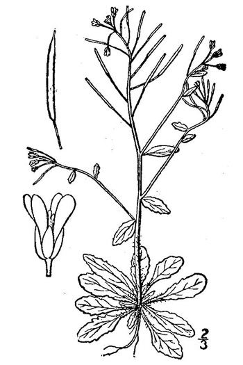
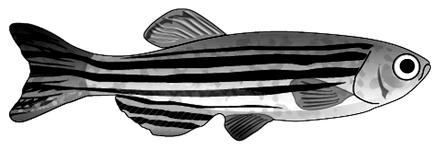

## About COBIND

**COBIND** pipeline aims to identify the co-binders/co-factors of
transcription factors (TFs). The method uses coordinates of
transcription factor binding sites (TFBSs) as an input and returns
information about co-binders and their binding fashion — spacings
between the two binding sites.

This repository and its contents were used to produce the results for
the COBIND manuscript. We made available COBIND as a tool, which can be
found [here](https://bitbucket.org/CBGR/cobind_tool/src/master/).

## What to expect from this page?

This page contains results from COBIND 2022 analysis. We analysed 8,792
datasets of high-confidence TFBSs stored in [UniBind
2021](https://unibind.uio.no/) database from 7 species ( *Arabidopsis
thaliana*, *Caenorhabditis elegans*, *Danio rerio*, *Drosophila
melanogaster*, *Homo sapiens*, *Mus musculus* and *Rattus norvegicus*)
for 404 unique TFs.

Reports about discovered co-binders are provided for each TF (where at
least one co-binder was discovered) in different species. Another group
of reports report the discovered co-binders summarized over TF families.

# Results

## Individual transcription factors

### **Arabidopsis thaliana**

</img>  
{:height=‘10px’}  
\[\[images/species_icons/ARABIDOPSIS.jpg\|height=20px\]\]

<b> Click to access results for each TF. </b>

-   [ABF1](COBIND_results/individual/ARABIDOPSIS_0.99/reports/ABF1/COBIND_analysis_report_ABF1.html)
-   [ABF3](COBIND_results/individual/ARABIDOPSIS_0.99/reports/ABF3/COBIND_analysis_report_ABF3.html)
-   [ABF4](COBIND_results/individual/ARABIDOPSIS_0.99/reports/ABF4/COBIND_analysis_report_ABF4.html)
-   [ATHB7](COBIND_results/individual/ARABIDOPSIS_0.99/reports/ATHB7/COBIND_analysis_report_ATHB7.html)
-   [GBF2](COBIND_results/individual/ARABIDOPSIS_0.99/reports/GBF2/COBIND_analysis_report_GBF2.html)
-   [GBF3](COBIND_results/individual/ARABIDOPSIS_0.99/reports/GBF3/COBIND_analysis_report_GBF3.html)
-   [HAT22](COBIND_results/individual/ARABIDOPSIS_0.99/reports/HAT22/COBIND_analysis_report_HAT22.html)
-   [HY5](COBIND_results/individual/ARABIDOPSIS_0.99/reports/HY5/COBIND_analysis_report_HY5.html)
-   [KAN1](COBIND_results/individual/ARABIDOPSIS_0.99/reports/KAN1/COBIND_analysis_report_KAN1.html)
-   [WRKY18](COBIND_results/individual/ARABIDOPSIS_0.99/reports/WRKY18/COBIND_analysis_report_WRKY18.html)
-   [WRKY33](COBIND_results/individual/ARABIDOPSIS_0.99/reports/WRKY33/COBIND_analysis_report_WRKY33.html)
-   [WRKY40](COBIND_results/individual/ARABIDOPSIS_0.99/reports/WRKY40/COBIND_analysis_report_WRKY40.html)

### **Caenorhabditis elegans**

</img>  
{:height=‘10px’}  
\[\[images/species_icons/CELEGANS.png\|height=20px\]\]

<b> Click to access results for each TF. </b>

-   [EFL-1](COBIND_results/individual/CELEGANS_0.99/reports/EFL-1/COBIND_analysis_report_EFL-1.html)
-   [PHA-4](COBIND_results/individual/CELEGANS_0.99/reports/PHA-4/COBIND_analysis_report_PHA-4.html)

### **Danio rerio**

</img>  
{:height=‘10px’}  
\[\[images/species_icons/DRERIO.png\|height=20px\]\]

<b> Click to access results for each TF. </b>

-   [CTCF](COBIND_results/individual/DRERIO_0.99/reports/CTCF/COBIND_analysis_report_CTCF.html)

### **Drosophila melanogaster**

</img>  
{:height=‘10px’}  
\[\[images/species_icons/DROSOPHILA.svg\|height=20px\]\]

<b> Click to access results for each TF. </b>

-   [BEAF-32](COBIND_results/individual/DROSOPHILA_0.99/reports/BEAF-32/COBIND_analysis_report_BEAF-32.html)
-   [CLAMP](COBIND_results/individual/DROSOPHILA_0.99/reports/CLAMP/COBIND_analysis_report_CLAMP.html)
-   [CTCF](COBIND_results/individual/DROSOPHILA_0.99/reports/CTCF/COBIND_analysis_report_CTCF.html)
-   [GRH](COBIND_results/individual/DROSOPHILA_0.99/reports/GRH/COBIND_analysis_report_GRH.html)
-   [GT](COBIND_results/individual/DROSOPHILA_0.99/reports/GT/COBIND_analysis_report_GT.html)
-   [HSF](COBIND_results/individual/DROSOPHILA_0.99/reports/HSF/COBIND_analysis_report_HSF.html)
-   [PDP1](COBIND_results/individual/DROSOPHILA_0.99/reports/PDP1/COBIND_analysis_report_PDP1.html)
-   [PHO](COBIND_results/individual/DROSOPHILA_0.99/reports/PHO/COBIND_analysis_report_PHO.html)
-   [TRL](COBIND_results/individual/DROSOPHILA_0.99/reports/TRL/COBIND_analysis_report_TRL.html)
-   [TWI](COBIND_results/individual/DROSOPHILA_0.99/reports/TWI/COBIND_analysis_report_TWI.html)

### **Homo sapiens**

</img>  
{:height=‘10px’}  
\[\[images/species_icons/HUMAN.svg\|height=20px\]\]

<b> Click to access results for each TF. </b>

-   [AR](COBIND_results/individual/HUMAN_0.99/reports/AR/COBIND_analysis_report_AR.html)
-   [ARNT-HIF1A](COBIND_results/individual/HUMAN_0.99/reports/ARNT-HIF1A/COBIND_analysis_report_ARNT-HIF1A.html)
-   [ARNT](COBIND_results/individual/HUMAN_0.99/reports/ARNT/COBIND_analysis_report_ARNT.html)
-   [ASCL1](COBIND_results/individual/HUMAN_0.99/reports/ASCL1/COBIND_analysis_report_ASCL1.html)
-   [ATF3](COBIND_results/individual/HUMAN_0.99/reports/ATF3/COBIND_analysis_report_ATF3.html)
-   [BACH2-VAR2](COBIND_results/individual/HUMAN_0.99/reports/BACH2-VAR2/COBIND_analysis_report_BACH2-VAR2.html)
-   [BACH2](COBIND_results/individual/HUMAN_0.99/reports/BACH2/COBIND_analysis_report_BACH2.html)
-   [BATF-JUN](COBIND_results/individual/HUMAN_0.99/reports/BATF-JUN/COBIND_analysis_report_BATF-JUN.html)
-   [BATF3](COBIND_results/individual/HUMAN_0.99/reports/BATF3/COBIND_analysis_report_BATF3.html)
-   [BCL6](COBIND_results/individual/HUMAN_0.99/reports/BCL6/COBIND_analysis_report_BCL6.html)
-   [CDX2](COBIND_results/individual/HUMAN_0.99/reports/CDX2/COBIND_analysis_report_CDX2.html)
-   [CEBPA](COBIND_results/individual/HUMAN_0.99/reports/CEBPA/COBIND_analysis_report_CEBPA.html)
-   [CREB1](COBIND_results/individual/HUMAN_0.99/reports/CREB1/COBIND_analysis_report_CREB1.html)
-   [CTCF](COBIND_results/individual/HUMAN_0.99/reports/CTCF/COBIND_analysis_report_CTCF.html)
-   [CTCFL](COBIND_results/individual/HUMAN_0.99/reports/CTCFL/COBIND_analysis_report_CTCFL.html)
-   [DDIT3-CEBPA](COBIND_results/individual/HUMAN_0.99/reports/DDIT3-CEBPA/COBIND_analysis_report_DDIT3-CEBPA.html)
-   [ERG](COBIND_results/individual/HUMAN_0.99/reports/ERG/COBIND_analysis_report_ERG.html)
-   [ESR1](COBIND_results/individual/HUMAN_0.99/reports/ESR1/COBIND_analysis_report_ESR1.html)
-   [ESRRA](COBIND_results/individual/HUMAN_0.99/reports/ESRRA/COBIND_analysis_report_ESRRA.html)
-   [ETV1](COBIND_results/individual/HUMAN_0.99/reports/ETV1/COBIND_analysis_report_ETV1.html)
-   [ETV6](COBIND_results/individual/HUMAN_0.99/reports/ETV6/COBIND_analysis_report_ETV6.html)
-   [FLI1](COBIND_results/individual/HUMAN_0.99/reports/FLI1/COBIND_analysis_report_FLI1.html)
-   [FOS-JUN](COBIND_results/individual/HUMAN_0.99/reports/FOS-JUN/COBIND_analysis_report_FOS-JUN.html)
-   [FOS-JUNB](COBIND_results/individual/HUMAN_0.99/reports/FOS-JUNB/COBIND_analysis_report_FOS-JUNB.html)
-   [FOS-JUND](COBIND_results/individual/HUMAN_0.99/reports/FOS-JUND/COBIND_analysis_report_FOS-JUND.html)
-   [FOS](COBIND_results/individual/HUMAN_0.99/reports/FOS/COBIND_analysis_report_FOS.html)
-   [FOSB-JUN](COBIND_results/individual/HUMAN_0.99/reports/FOSB-JUN/COBIND_analysis_report_FOSB-JUN.html)
-   [FOSB-JUNB](COBIND_results/individual/HUMAN_0.99/reports/FOSB-JUNB/COBIND_analysis_report_FOSB-JUNB.html)
-   [FOSL1-JUN](COBIND_results/individual/HUMAN_0.99/reports/FOSL1-JUN/COBIND_analysis_report_FOSL1-JUN.html)
-   [FOSL1-JUNB](COBIND_results/individual/HUMAN_0.99/reports/FOSL1-JUNB/COBIND_analysis_report_FOSL1-JUNB.html)
-   [FOSL1-JUND](COBIND_results/individual/HUMAN_0.99/reports/FOSL1-JUND/COBIND_analysis_report_FOSL1-JUND.html)
-   [FOSL1](COBIND_results/individual/HUMAN_0.99/reports/FOSL1/COBIND_analysis_report_FOSL1.html)
-   [FOSL2-JUN](COBIND_results/individual/HUMAN_0.99/reports/FOSL2-JUN/COBIND_analysis_report_FOSL2-JUN.html)
-   [FOSL2-JUNB](COBIND_results/individual/HUMAN_0.99/reports/FOSL2-JUNB/COBIND_analysis_report_FOSL2-JUNB.html)
-   [FOSL2-JUND](COBIND_results/individual/HUMAN_0.99/reports/FOSL2-JUND/COBIND_analysis_report_FOSL2-JUND.html)
-   [FOSL2](COBIND_results/individual/HUMAN_0.99/reports/FOSL2/COBIND_analysis_report_FOSL2.html)
-   [FOXA1](COBIND_results/individual/HUMAN_0.99/reports/FOXA1/COBIND_analysis_report_FOXA1.html)
-   [FOXA2](COBIND_results/individual/HUMAN_0.99/reports/FOXA2/COBIND_analysis_report_FOXA2.html)
-   [FOXK2](COBIND_results/individual/HUMAN_0.99/reports/FOXK2/COBIND_analysis_report_FOXK2.html)
-   [FOXP1](COBIND_results/individual/HUMAN_0.99/reports/FOXP1/COBIND_analysis_report_FOXP1.html)
-   [GABPA](COBIND_results/individual/HUMAN_0.99/reports/GABPA/COBIND_analysis_report_GABPA.html)
-   [GATA1-TAL1](COBIND_results/individual/HUMAN_0.99/reports/GATA1-TAL1/COBIND_analysis_report_GATA1-TAL1.html)
-   [GATA1](COBIND_results/individual/HUMAN_0.99/reports/GATA1/COBIND_analysis_report_GATA1.html)
-   [GATA2](COBIND_results/individual/HUMAN_0.99/reports/GATA2/COBIND_analysis_report_GATA2.html)
-   [GATA3](COBIND_results/individual/HUMAN_0.99/reports/GATA3/COBIND_analysis_report_GATA3.html)
-   [GATA4](COBIND_results/individual/HUMAN_0.99/reports/GATA4/COBIND_analysis_report_GATA4.html)
-   [GATA6](COBIND_results/individual/HUMAN_0.99/reports/GATA6/COBIND_analysis_report_GATA6.html)
-   [GLIS1](COBIND_results/individual/HUMAN_0.99/reports/GLIS1/COBIND_analysis_report_GLIS1.html)
-   [GRHL2](COBIND_results/individual/HUMAN_0.99/reports/GRHL2/COBIND_analysis_report_GRHL2.html)
-   [HAND2](COBIND_results/individual/HUMAN_0.99/reports/HAND2/COBIND_analysis_report_HAND2.html)
-   [HIF1A](COBIND_results/individual/HUMAN_0.99/reports/HIF1A/COBIND_analysis_report_HIF1A.html)
-   [HNF1A](COBIND_results/individual/HUMAN_0.99/reports/HNF1A/COBIND_analysis_report_HNF1A.html)
-   [HNF1B](COBIND_results/individual/HUMAN_0.99/reports/HNF1B/COBIND_analysis_report_HNF1B.html)
-   [HNF4A](COBIND_results/individual/HUMAN_0.99/reports/HNF4A/COBIND_analysis_report_HNF4A.html)
-   [HNF4G](COBIND_results/individual/HUMAN_0.99/reports/HNF4G/COBIND_analysis_report_HNF4G.html)
-   [HOXA9](COBIND_results/individual/HUMAN_0.99/reports/HOXA9/COBIND_analysis_report_HOXA9.html)
-   [HOXB13](COBIND_results/individual/HUMAN_0.99/reports/HOXB13/COBIND_analysis_report_HOXB13.html)
-   [HSF1](COBIND_results/individual/HUMAN_0.99/reports/HSF1/COBIND_analysis_report_HSF1.html)
-   [IRF3](COBIND_results/individual/HUMAN_0.99/reports/IRF3/COBIND_analysis_report_IRF3.html)
-   [IRF4](COBIND_results/individual/HUMAN_0.99/reports/IRF4/COBIND_analysis_report_IRF4.html)
-   [ISL1](COBIND_results/individual/HUMAN_0.99/reports/ISL1/COBIND_analysis_report_ISL1.html)
-   [JUN-JUNB](COBIND_results/individual/HUMAN_0.99/reports/JUN-JUNB/COBIND_analysis_report_JUN-JUNB.html)
-   [JUN-VAR2](COBIND_results/individual/HUMAN_0.99/reports/JUN-VAR2/COBIND_analysis_report_JUN-VAR2.html)
-   [JUN](COBIND_results/individual/HUMAN_0.99/reports/JUN/COBIND_analysis_report_JUN.html)
-   [JUNB-VAR2](COBIND_results/individual/HUMAN_0.99/reports/JUNB-VAR2/COBIND_analysis_report_JUNB-VAR2.html)
-   [JUNB](COBIND_results/individual/HUMAN_0.99/reports/JUNB/COBIND_analysis_report_JUNB.html)
-   [JUND-VAR2](COBIND_results/individual/HUMAN_0.99/reports/JUND-VAR2/COBIND_analysis_report_JUND-VAR2.html)
-   [JUND](COBIND_results/individual/HUMAN_0.99/reports/JUND/COBIND_analysis_report_JUND.html)
-   [KLF16](COBIND_results/individual/HUMAN_0.99/reports/KLF16/COBIND_analysis_report_KLF16.html)
-   [KLF4](COBIND_results/individual/HUMAN_0.99/reports/KLF4/COBIND_analysis_report_KLF4.html)
-   [LEF1](COBIND_results/individual/HUMAN_0.99/reports/LEF1/COBIND_analysis_report_LEF1.html)
-   [LHX2](COBIND_results/individual/HUMAN_0.99/reports/LHX2/COBIND_analysis_report_LHX2.html)
-   [MAF-NFE2](COBIND_results/individual/HUMAN_0.99/reports/MAF-NFE2/COBIND_analysis_report_MAF-NFE2.html)
-   [MAF](COBIND_results/individual/HUMAN_0.99/reports/MAF/COBIND_analysis_report_MAF.html)
-   [MAFB](COBIND_results/individual/HUMAN_0.99/reports/MAFB/COBIND_analysis_report_MAFB.html)
-   [MAFF](COBIND_results/individual/HUMAN_0.99/reports/MAFF/COBIND_analysis_report_MAFF.html)
-   [MAFK](COBIND_results/individual/HUMAN_0.99/reports/MAFK/COBIND_analysis_report_MAFK.html)
-   [MAX-MYC](COBIND_results/individual/HUMAN_0.99/reports/MAX-MYC/COBIND_analysis_report_MAX-MYC.html)
-   [MAX](COBIND_results/individual/HUMAN_0.99/reports/MAX/COBIND_analysis_report_MAX.html)
-   [MECOM](COBIND_results/individual/HUMAN_0.99/reports/MECOM/COBIND_analysis_report_MECOM.html)
-   [MEF2A](COBIND_results/individual/HUMAN_0.99/reports/MEF2A/COBIND_analysis_report_MEF2A.html)
-   [MEF2B](COBIND_results/individual/HUMAN_0.99/reports/MEF2B/COBIND_analysis_report_MEF2B.html)
-   [MEIS1](COBIND_results/individual/HUMAN_0.99/reports/MEIS1/COBIND_analysis_report_MEIS1.html)
-   [MITF](COBIND_results/individual/HUMAN_0.99/reports/MITF/COBIND_analysis_report_MITF.html)
-   [MYC](COBIND_results/individual/HUMAN_0.99/reports/MYC/COBIND_analysis_report_MYC.html)
-   [MYOD1](COBIND_results/individual/HUMAN_0.99/reports/MYOD1/COBIND_analysis_report_MYOD1.html)
-   [NEUROG2-VAR2](COBIND_results/individual/HUMAN_0.99/reports/NEUROG2-VAR2/COBIND_analysis_report_NEUROG2-VAR2.html)
-   [NEUROG2](COBIND_results/individual/HUMAN_0.99/reports/NEUROG2/COBIND_analysis_report_NEUROG2.html)
-   [NFE2](COBIND_results/individual/HUMAN_0.99/reports/NFE2/COBIND_analysis_report_NFE2.html)
-   [NFE2L2](COBIND_results/individual/HUMAN_0.99/reports/NFE2L2/COBIND_analysis_report_NFE2L2.html)
-   [NFIA](COBIND_results/individual/HUMAN_0.99/reports/NFIA/COBIND_analysis_report_NFIA.html)
-   [NFIC](COBIND_results/individual/HUMAN_0.99/reports/NFIC/COBIND_analysis_report_NFIC.html)
-   [NFKB1](COBIND_results/individual/HUMAN_0.99/reports/NFKB1/COBIND_analysis_report_NFKB1.html)
-   [NR1H2-RXRA](COBIND_results/individual/HUMAN_0.99/reports/NR1H2-RXRA/COBIND_analysis_report_NR1H2-RXRA.html)
-   [NR1H3-RXRA](COBIND_results/individual/HUMAN_0.99/reports/NR1H3-RXRA/COBIND_analysis_report_NR1H3-RXRA.html)
-   [NR1H4-RXRA](COBIND_results/individual/HUMAN_0.99/reports/NR1H4-RXRA/COBIND_analysis_report_NR1H4-RXRA.html)
-   [NR1H4](COBIND_results/individual/HUMAN_0.99/reports/NR1H4/COBIND_analysis_report_NR1H4.html)
-   [NR2C1](COBIND_results/individual/HUMAN_0.99/reports/NR2C1/COBIND_analysis_report_NR2C1.html)
-   [NR2C2-VAR2](COBIND_results/individual/HUMAN_0.99/reports/NR2C2-VAR2/COBIND_analysis_report_NR2C2-VAR2.html)
-   [NR2F2](COBIND_results/individual/HUMAN_0.99/reports/NR2F2/COBIND_analysis_report_NR2F2.html)
-   [NR3C1](COBIND_results/individual/HUMAN_0.99/reports/NR3C1/COBIND_analysis_report_NR3C1.html)
-   [NR4A2-RXRA](COBIND_results/individual/HUMAN_0.99/reports/NR4A2-RXRA/COBIND_analysis_report_NR4A2-RXRA.html)
-   [NRF1](COBIND_results/individual/HUMAN_0.99/reports/NRF1/COBIND_analysis_report_NRF1.html)
-   [ONECUT1](COBIND_results/individual/HUMAN_0.99/reports/ONECUT1/COBIND_analysis_report_ONECUT1.html)
-   [PAX5](COBIND_results/individual/HUMAN_0.99/reports/PAX5/COBIND_analysis_report_PAX5.html)
-   [PAX6](COBIND_results/individual/HUMAN_0.99/reports/PAX6/COBIND_analysis_report_PAX6.html)
-   [PBX2](COBIND_results/individual/HUMAN_0.99/reports/PBX2/COBIND_analysis_report_PBX2.html)
-   [PBX3](COBIND_results/individual/HUMAN_0.99/reports/PBX3/COBIND_analysis_report_PBX3.html)
-   [PDX1](COBIND_results/individual/HUMAN_0.99/reports/PDX1/COBIND_analysis_report_PDX1.html)
-   [PKNOX1](COBIND_results/individual/HUMAN_0.99/reports/PKNOX1/COBIND_analysis_report_PKNOX1.html)
-   [POU5F1-SOX2](COBIND_results/individual/HUMAN_0.99/reports/POU5F1-SOX2/COBIND_analysis_report_POU5F1-SOX2.html)
-   [POU5F1](COBIND_results/individual/HUMAN_0.99/reports/POU5F1/COBIND_analysis_report_POU5F1.html)
-   [PPARA-RXRA](COBIND_results/individual/HUMAN_0.99/reports/PPARA-RXRA/COBIND_analysis_report_PPARA-RXRA.html)
-   [PPARG-RXRA](COBIND_results/individual/HUMAN_0.99/reports/PPARG-RXRA/COBIND_analysis_report_PPARG-RXRA.html)
-   [PPARG](COBIND_results/individual/HUMAN_0.99/reports/PPARG/COBIND_analysis_report_PPARG.html)
-   [PRDM1](COBIND_results/individual/HUMAN_0.99/reports/PRDM1/COBIND_analysis_report_PRDM1.html)
-   [PRDM4](COBIND_results/individual/HUMAN_0.99/reports/PRDM4/COBIND_analysis_report_PRDM4.html)
-   [RARA-RXRA](COBIND_results/individual/HUMAN_0.99/reports/RARA-RXRA/COBIND_analysis_report_RARA-RXRA.html)
-   [RARA-VAR2](COBIND_results/individual/HUMAN_0.99/reports/RARA-VAR2/COBIND_analysis_report_RARA-VAR2.html)
-   [RBPJ](COBIND_results/individual/HUMAN_0.99/reports/RBPJ/COBIND_analysis_report_RBPJ.html)
-   [RELA](COBIND_results/individual/HUMAN_0.99/reports/RELA/COBIND_analysis_report_RELA.html)
-   [RELB](COBIND_results/individual/HUMAN_0.99/reports/RELB/COBIND_analysis_report_RELB.html)
-   [REST](COBIND_results/individual/HUMAN_0.99/reports/REST/COBIND_analysis_report_REST.html)
-   [RFX3](COBIND_results/individual/HUMAN_0.99/reports/RFX3/COBIND_analysis_report_RFX3.html)
-   [RFX5](COBIND_results/individual/HUMAN_0.99/reports/RFX5/COBIND_analysis_report_RFX5.html)
-   [RUNX1](COBIND_results/individual/HUMAN_0.99/reports/RUNX1/COBIND_analysis_report_RUNX1.html)
-   [RUNX2](COBIND_results/individual/HUMAN_0.99/reports/RUNX2/COBIND_analysis_report_RUNX2.html)
-   [RXRA-VDR](COBIND_results/individual/HUMAN_0.99/reports/RXRA-VDR/COBIND_analysis_report_RXRA-VDR.html)
-   [RXRA](COBIND_results/individual/HUMAN_0.99/reports/RXRA/COBIND_analysis_report_RXRA.html)
-   [SIX1](COBIND_results/individual/HUMAN_0.99/reports/SIX1/COBIND_analysis_report_SIX1.html)
-   [SMAD2-SMAD3-SMAD4](COBIND_results/individual/HUMAN_0.99/reports/SMAD2-SMAD3-SMAD4/COBIND_analysis_report_SMAD2-SMAD3-SMAD4.html)
-   [SMAD2-SMAD3](COBIND_results/individual/HUMAN_0.99/reports/SMAD2-SMAD3/COBIND_analysis_report_SMAD2-SMAD3.html)
-   [SMAD3](COBIND_results/individual/HUMAN_0.99/reports/SMAD3/COBIND_analysis_report_SMAD3.html)
-   [SMAD4](COBIND_results/individual/HUMAN_0.99/reports/SMAD4/COBIND_analysis_report_SMAD4.html)
-   [SOX10](COBIND_results/individual/HUMAN_0.99/reports/SOX10/COBIND_analysis_report_SOX10.html)
-   [SOX13](COBIND_results/individual/HUMAN_0.99/reports/SOX13/COBIND_analysis_report_SOX13.html)
-   [SOX17](COBIND_results/individual/HUMAN_0.99/reports/SOX17/COBIND_analysis_report_SOX17.html)
-   [SOX2](COBIND_results/individual/HUMAN_0.99/reports/SOX2/COBIND_analysis_report_SOX2.html)
-   [SOX6](COBIND_results/individual/HUMAN_0.99/reports/SOX6/COBIND_analysis_report_SOX6.html)
-   [SP1](COBIND_results/individual/HUMAN_0.99/reports/SP1/COBIND_analysis_report_SP1.html)
-   [SP2](COBIND_results/individual/HUMAN_0.99/reports/SP2/COBIND_analysis_report_SP2.html)
-   [SP3](COBIND_results/individual/HUMAN_0.99/reports/SP3/COBIND_analysis_report_SP3.html)
-   [SPI1](COBIND_results/individual/HUMAN_0.99/reports/SPI1/COBIND_analysis_report_SPI1.html)
-   [STAT1-STAT2](COBIND_results/individual/HUMAN_0.99/reports/STAT1-STAT2/COBIND_analysis_report_STAT1-STAT2.html)
-   [STAT3](COBIND_results/individual/HUMAN_0.99/reports/STAT3/COBIND_analysis_report_STAT3.html)
-   [STAT4](COBIND_results/individual/HUMAN_0.99/reports/STAT4/COBIND_analysis_report_STAT4.html)
-   [TAL1-TCF3](COBIND_results/individual/HUMAN_0.99/reports/TAL1-TCF3/COBIND_analysis_report_TAL1-TCF3.html)
-   [TBX5](COBIND_results/individual/HUMAN_0.99/reports/TBX5/COBIND_analysis_report_TBX5.html)
-   [TBXT](COBIND_results/individual/HUMAN_0.99/reports/TBXT/COBIND_analysis_report_TBXT.html)
-   [TCF12-VAR2](COBIND_results/individual/HUMAN_0.99/reports/TCF12-VAR2/COBIND_analysis_report_TCF12-VAR2.html)
-   [TCF12](COBIND_results/individual/HUMAN_0.99/reports/TCF12/COBIND_analysis_report_TCF12.html)
-   [TCF4](COBIND_results/individual/HUMAN_0.99/reports/TCF4/COBIND_analysis_report_TCF4.html)
-   [TCF7](COBIND_results/individual/HUMAN_0.99/reports/TCF7/COBIND_analysis_report_TCF7.html)
-   [TCF7L2](COBIND_results/individual/HUMAN_0.99/reports/TCF7L2/COBIND_analysis_report_TCF7L2.html)
-   [TEAD1](COBIND_results/individual/HUMAN_0.99/reports/TEAD1/COBIND_analysis_report_TEAD1.html)
-   [TEAD4](COBIND_results/individual/HUMAN_0.99/reports/TEAD4/COBIND_analysis_report_TEAD4.html)
-   [TFAP2A-VAR2](COBIND_results/individual/HUMAN_0.99/reports/TFAP2A-VAR2/COBIND_analysis_report_TFAP2A-VAR2.html)
-   [TFAP2A-VAR3](COBIND_results/individual/HUMAN_0.99/reports/TFAP2A-VAR3/COBIND_analysis_report_TFAP2A-VAR3.html)
-   [TFAP4](COBIND_results/individual/HUMAN_0.99/reports/TFAP4/COBIND_analysis_report_TFAP4.html)
-   [THAP11](COBIND_results/individual/HUMAN_0.99/reports/THAP11/COBIND_analysis_report_THAP11.html)
-   [THRB](COBIND_results/individual/HUMAN_0.99/reports/THRB/COBIND_analysis_report_THRB.html)
-   [TP53](COBIND_results/individual/HUMAN_0.99/reports/TP53/COBIND_analysis_report_TP53.html)
-   [TP63](COBIND_results/individual/HUMAN_0.99/reports/TP63/COBIND_analysis_report_TP63.html)
-   [TWIST1](COBIND_results/individual/HUMAN_0.99/reports/TWIST1/COBIND_analysis_report_TWIST1.html)
-   [USF2](COBIND_results/individual/HUMAN_0.99/reports/USF2/COBIND_analysis_report_USF2.html)
-   [VDR](COBIND_results/individual/HUMAN_0.99/reports/VDR/COBIND_analysis_report_VDR.html)
-   [YY1](COBIND_results/individual/HUMAN_0.99/reports/YY1/COBIND_analysis_report_YY1.html)
-   [ZNF143](COBIND_results/individual/HUMAN_0.99/reports/ZNF143/COBIND_analysis_report_ZNF143.html)

### **Mus musculus**

</img>  
{:height=‘10px’}  
\[\[images/species_icons/MOUSE.svg\|height=20px\]\]

<b> Click to access results for each TF. </b>

-   [AR](COBIND_results/individual/MOUSE_0.99/reports/AR/COBIND_analysis_report_AR.html)
-   [ARNTL](COBIND_results/individual/MOUSE_0.99/reports/ARNTL/COBIND_analysis_report_ARNTL.html)
-   [ASCL1-VAR2](COBIND_results/individual/MOUSE_0.99/reports/ASCL1-VAR2/COBIND_analysis_report_ASCL1-VAR2.html)
-   [ASCL1](COBIND_results/individual/MOUSE_0.99/reports/ASCL1/COBIND_analysis_report_ASCL1.html)
-   [ATF4](COBIND_results/individual/MOUSE_0.99/reports/ATF4/COBIND_analysis_report_ATF4.html)
-   [ATOH1](COBIND_results/individual/MOUSE_0.99/reports/ATOH1/COBIND_analysis_report_ATOH1.html)
-   [BACH1-MAFK](COBIND_results/individual/MOUSE_0.99/reports/BACH1-MAFK/COBIND_analysis_report_BACH1-MAFK.html)
-   [BACH2-VAR2](COBIND_results/individual/MOUSE_0.99/reports/BACH2-VAR2/COBIND_analysis_report_BACH2-VAR2.html)
-   [BACH2](COBIND_results/individual/MOUSE_0.99/reports/BACH2/COBIND_analysis_report_BACH2.html)
-   [BATF-JUN](COBIND_results/individual/MOUSE_0.99/reports/BATF-JUN/COBIND_analysis_report_BATF-JUN.html)
-   [BATF](COBIND_results/individual/MOUSE_0.99/reports/BATF/COBIND_analysis_report_BATF.html)
-   [CEBPA](COBIND_results/individual/MOUSE_0.99/reports/CEBPA/COBIND_analysis_report_CEBPA.html)
-   [CEBPB](COBIND_results/individual/MOUSE_0.99/reports/CEBPB/COBIND_analysis_report_CEBPB.html)
-   [CEBPE](COBIND_results/individual/MOUSE_0.99/reports/CEBPE/COBIND_analysis_report_CEBPE.html)
-   [CEBPG-VAR2](COBIND_results/individual/MOUSE_0.99/reports/CEBPG-VAR2/COBIND_analysis_report_CEBPG-VAR2.html)
-   [CEBPG](COBIND_results/individual/MOUSE_0.99/reports/CEBPG/COBIND_analysis_report_CEBPG.html)
-   [CLOCK](COBIND_results/individual/MOUSE_0.99/reports/CLOCK/COBIND_analysis_report_CLOCK.html)
-   [CREB1](COBIND_results/individual/MOUSE_0.99/reports/CREB1/COBIND_analysis_report_CREB1.html)
-   [CRX](COBIND_results/individual/MOUSE_0.99/reports/CRX/COBIND_analysis_report_CRX.html)
-   [CTCF](COBIND_results/individual/MOUSE_0.99/reports/CTCF/COBIND_analysis_report_CTCF.html)
-   [CTCFL](COBIND_results/individual/MOUSE_0.99/reports/CTCFL/COBIND_analysis_report_CTCFL.html)
-   [DDIT3-CEBPA](COBIND_results/individual/MOUSE_0.99/reports/DDIT3-CEBPA/COBIND_analysis_report_DDIT3-CEBPA.html)
-   [DMRT1](COBIND_results/individual/MOUSE_0.99/reports/DMRT1/COBIND_analysis_report_DMRT1.html)
-   [ELF5](COBIND_results/individual/MOUSE_0.99/reports/ELF5/COBIND_analysis_report_ELF5.html)
-   [ESR1](COBIND_results/individual/MOUSE_0.99/reports/ESR1/COBIND_analysis_report_ESR1.html)
-   [ESRRB](COBIND_results/individual/MOUSE_0.99/reports/ESRRB/COBIND_analysis_report_ESRRB.html)
-   [FLI1](COBIND_results/individual/MOUSE_0.99/reports/FLI1/COBIND_analysis_report_FLI1.html)
-   [FOS-JUN](COBIND_results/individual/MOUSE_0.99/reports/FOS-JUN/COBIND_analysis_report_FOS-JUN.html)
-   [FOS-JUNB](COBIND_results/individual/MOUSE_0.99/reports/FOS-JUNB/COBIND_analysis_report_FOS-JUNB.html)
-   [FOS-JUND](COBIND_results/individual/MOUSE_0.99/reports/FOS-JUND/COBIND_analysis_report_FOS-JUND.html)
-   [FOS](COBIND_results/individual/MOUSE_0.99/reports/FOS/COBIND_analysis_report_FOS.html)
-   [FOSB-JUN](COBIND_results/individual/MOUSE_0.99/reports/FOSB-JUN/COBIND_analysis_report_FOSB-JUN.html)
-   [FOSB-JUNB](COBIND_results/individual/MOUSE_0.99/reports/FOSB-JUNB/COBIND_analysis_report_FOSB-JUNB.html)
-   [FOSL1-JUN](COBIND_results/individual/MOUSE_0.99/reports/FOSL1-JUN/COBIND_analysis_report_FOSL1-JUN.html)
-   [FOSL1-JUNB](COBIND_results/individual/MOUSE_0.99/reports/FOSL1-JUNB/COBIND_analysis_report_FOSL1-JUNB.html)
-   [FOSL1-JUND](COBIND_results/individual/MOUSE_0.99/reports/FOSL1-JUND/COBIND_analysis_report_FOSL1-JUND.html)
-   [FOSL1](COBIND_results/individual/MOUSE_0.99/reports/FOSL1/COBIND_analysis_report_FOSL1.html)
-   [FOSL2-JUN](COBIND_results/individual/MOUSE_0.99/reports/FOSL2-JUN/COBIND_analysis_report_FOSL2-JUN.html)
-   [FOSL2-JUNB](COBIND_results/individual/MOUSE_0.99/reports/FOSL2-JUNB/COBIND_analysis_report_FOSL2-JUNB.html)
-   [FOSL2-JUND](COBIND_results/individual/MOUSE_0.99/reports/FOSL2-JUND/COBIND_analysis_report_FOSL2-JUND.html)
-   [FOXA1](COBIND_results/individual/MOUSE_0.99/reports/FOXA1/COBIND_analysis_report_FOXA1.html)
-   [FOXA2](COBIND_results/individual/MOUSE_0.99/reports/FOXA2/COBIND_analysis_report_FOXA2.html)
-   [FOXA3](COBIND_results/individual/MOUSE_0.99/reports/FOXA3/COBIND_analysis_report_FOXA3.html)
-   [FOXG1](COBIND_results/individual/MOUSE_0.99/reports/FOXG1/COBIND_analysis_report_FOXG1.html)
-   [GABPA](COBIND_results/individual/MOUSE_0.99/reports/GABPA/COBIND_analysis_report_GABPA.html)
-   [GATA1-TAL1](COBIND_results/individual/MOUSE_0.99/reports/GATA1-TAL1/COBIND_analysis_report_GATA1-TAL1.html)
-   [GATA1](COBIND_results/individual/MOUSE_0.99/reports/GATA1/COBIND_analysis_report_GATA1.html)
-   [GATA2](COBIND_results/individual/MOUSE_0.99/reports/GATA2/COBIND_analysis_report_GATA2.html)
-   [GATA3](COBIND_results/individual/MOUSE_0.99/reports/GATA3/COBIND_analysis_report_GATA3.html)
-   [GATA4](COBIND_results/individual/MOUSE_0.99/reports/GATA4/COBIND_analysis_report_GATA4.html)
-   [GFI1](COBIND_results/individual/MOUSE_0.99/reports/GFI1/COBIND_analysis_report_GFI1.html)
-   [GRHL2](COBIND_results/individual/MOUSE_0.99/reports/GRHL2/COBIND_analysis_report_GRHL2.html)
-   [HAND1-TCF3](COBIND_results/individual/MOUSE_0.99/reports/HAND1-TCF3/COBIND_analysis_report_HAND1-TCF3.html)
-   [HAND2](COBIND_results/individual/MOUSE_0.99/reports/HAND2/COBIND_analysis_report_HAND2.html)
-   [HNF1B](COBIND_results/individual/MOUSE_0.99/reports/HNF1B/COBIND_analysis_report_HNF1B.html)
-   [HNF4A-VAR2](COBIND_results/individual/MOUSE_0.99/reports/HNF4A-VAR2/COBIND_analysis_report_HNF4A-VAR2.html)
-   [HNF4A](COBIND_results/individual/MOUSE_0.99/reports/HNF4A/COBIND_analysis_report_HNF4A.html)
-   [HNF4G](COBIND_results/individual/MOUSE_0.99/reports/HNF4G/COBIND_analysis_report_HNF4G.html)
-   [HOXB4](COBIND_results/individual/MOUSE_0.99/reports/HOXB4/COBIND_analysis_report_HOXB4.html)
-   [HOXC9](COBIND_results/individual/MOUSE_0.99/reports/HOXC9/COBIND_analysis_report_HOXC9.html)
-   [HOXD11](COBIND_results/individual/MOUSE_0.99/reports/HOXD11/COBIND_analysis_report_HOXD11.html)
-   [HOXD13](COBIND_results/individual/MOUSE_0.99/reports/HOXD13/COBIND_analysis_report_HOXD13.html)
-   [HSF1](COBIND_results/individual/MOUSE_0.99/reports/HSF1/COBIND_analysis_report_HSF1.html)
-   [IKZF1](COBIND_results/individual/MOUSE_0.99/reports/IKZF1/COBIND_analysis_report_IKZF1.html)
-   [IRF4](COBIND_results/individual/MOUSE_0.99/reports/IRF4/COBIND_analysis_report_IRF4.html)
-   [IRF8](COBIND_results/individual/MOUSE_0.99/reports/IRF8/COBIND_analysis_report_IRF8.html)
-   [ISL1](COBIND_results/individual/MOUSE_0.99/reports/ISL1/COBIND_analysis_report_ISL1.html)
-   [JUN-JUNB](COBIND_results/individual/MOUSE_0.99/reports/JUN-JUNB/COBIND_analysis_report_JUN-JUNB.html)
-   [JUN-VAR2](COBIND_results/individual/MOUSE_0.99/reports/JUN-VAR2/COBIND_analysis_report_JUN-VAR2.html)
-   [JUN](COBIND_results/individual/MOUSE_0.99/reports/JUN/COBIND_analysis_report_JUN.html)
-   [JUNB-VAR2](COBIND_results/individual/MOUSE_0.99/reports/JUNB-VAR2/COBIND_analysis_report_JUNB-VAR2.html)
-   [JUNB](COBIND_results/individual/MOUSE_0.99/reports/JUNB/COBIND_analysis_report_JUNB.html)
-   [JUND-VAR2](COBIND_results/individual/MOUSE_0.99/reports/JUND-VAR2/COBIND_analysis_report_JUND-VAR2.html)
-   [JUND](COBIND_results/individual/MOUSE_0.99/reports/JUND/COBIND_analysis_report_JUND.html)
-   [KLF5](COBIND_results/individual/MOUSE_0.99/reports/KLF5/COBIND_analysis_report_KLF5.html)
-   [LHX2](COBIND_results/individual/MOUSE_0.99/reports/LHX2/COBIND_analysis_report_LHX2.html)
-   [LHX3](COBIND_results/individual/MOUSE_0.99/reports/LHX3/COBIND_analysis_report_LHX3.html)
-   [LHX6](COBIND_results/individual/MOUSE_0.99/reports/LHX6/COBIND_analysis_report_LHX6.html)
-   [MAF-NFE2](COBIND_results/individual/MOUSE_0.99/reports/MAF-NFE2/COBIND_analysis_report_MAF-NFE2.html)
-   [MAF](COBIND_results/individual/MOUSE_0.99/reports/MAF/COBIND_analysis_report_MAF.html)
-   [MAFB](COBIND_results/individual/MOUSE_0.99/reports/MAFB/COBIND_analysis_report_MAFB.html)
-   [MAFF](COBIND_results/individual/MOUSE_0.99/reports/MAFF/COBIND_analysis_report_MAFF.html)
-   [MAFG](COBIND_results/individual/MOUSE_0.99/reports/MAFG/COBIND_analysis_report_MAFG.html)
-   [MAFK](COBIND_results/individual/MOUSE_0.99/reports/MAFK/COBIND_analysis_report_MAFK.html)
-   [MEF2A](COBIND_results/individual/MOUSE_0.99/reports/MEF2A/COBIND_analysis_report_MEF2A.html)
-   [MEF2C](COBIND_results/individual/MOUSE_0.99/reports/MEF2C/COBIND_analysis_report_MEF2C.html)
-   [MEF2D](COBIND_results/individual/MOUSE_0.99/reports/MEF2D/COBIND_analysis_report_MEF2D.html)
-   [MEIS1-VAR2](COBIND_results/individual/MOUSE_0.99/reports/MEIS1-VAR2/COBIND_analysis_report_MEIS1-VAR2.html)
-   [MEIS1](COBIND_results/individual/MOUSE_0.99/reports/MEIS1/COBIND_analysis_report_MEIS1.html)
-   [MYBL1](COBIND_results/individual/MOUSE_0.99/reports/MYBL1/COBIND_analysis_report_MYBL1.html)
-   [MYCN](COBIND_results/individual/MOUSE_0.99/reports/MYCN/COBIND_analysis_report_MYCN.html)
-   [MYF5](COBIND_results/individual/MOUSE_0.99/reports/MYF5/COBIND_analysis_report_MYF5.html)
-   [MYOD1](COBIND_results/individual/MOUSE_0.99/reports/MYOD1/COBIND_analysis_report_MYOD1.html)
-   [MYOG](COBIND_results/individual/MOUSE_0.99/reports/MYOG/COBIND_analysis_report_MYOG.html)
-   [NEUROD2](COBIND_results/individual/MOUSE_0.99/reports/NEUROD2/COBIND_analysis_report_NEUROD2.html)
-   [NFATC1](COBIND_results/individual/MOUSE_0.99/reports/NFATC1/COBIND_analysis_report_NFATC1.html)
-   [NFATC2](COBIND_results/individual/MOUSE_0.99/reports/NFATC2/COBIND_analysis_report_NFATC2.html)
-   [NFE2L1](COBIND_results/individual/MOUSE_0.99/reports/NFE2L1/COBIND_analysis_report_NFE2L1.html)
-   [NFE2L2](COBIND_results/individual/MOUSE_0.99/reports/NFE2L2/COBIND_analysis_report_NFE2L2.html)
-   [NFIA](COBIND_results/individual/MOUSE_0.99/reports/NFIA/COBIND_analysis_report_NFIA.html)
-   [NFIC-VAR2](COBIND_results/individual/MOUSE_0.99/reports/NFIC-VAR2/COBIND_analysis_report_NFIC-VAR2.html)
-   [NFIC](COBIND_results/individual/MOUSE_0.99/reports/NFIC/COBIND_analysis_report_NFIC.html)
-   [NFYA](COBIND_results/individual/MOUSE_0.99/reports/NFYA/COBIND_analysis_report_NFYA.html)
-   [NFYB](COBIND_results/individual/MOUSE_0.99/reports/NFYB/COBIND_analysis_report_NFYB.html)
-   [NFYC](COBIND_results/individual/MOUSE_0.99/reports/NFYC/COBIND_analysis_report_NFYC.html)
-   [NKX3-2](COBIND_results/individual/MOUSE_0.99/reports/NKX3-2/COBIND_analysis_report_NKX3-2.html)
-   [NKX6-1](COBIND_results/individual/MOUSE_0.99/reports/NKX6-1/COBIND_analysis_report_NKX6-1.html)
-   [NR1H2-RXRA](COBIND_results/individual/MOUSE_0.99/reports/NR1H2-RXRA/COBIND_analysis_report_NR1H2-RXRA.html)
-   [NR1H3-RXRA](COBIND_results/individual/MOUSE_0.99/reports/NR1H3-RXRA/COBIND_analysis_report_NR1H3-RXRA.html)
-   [NR1H4-RXRA](COBIND_results/individual/MOUSE_0.99/reports/NR1H4-RXRA/COBIND_analysis_report_NR1H4-RXRA.html)
-   [NR1H4](COBIND_results/individual/MOUSE_0.99/reports/NR1H4/COBIND_analysis_report_NR1H4.html)
-   [NR3C1](COBIND_results/individual/MOUSE_0.99/reports/NR3C1/COBIND_analysis_report_NR3C1.html)
-   [NR4A2-RXRA](COBIND_results/individual/MOUSE_0.99/reports/NR4A2-RXRA/COBIND_analysis_report_NR4A2-RXRA.html)
-   [OLIG2](COBIND_results/individual/MOUSE_0.99/reports/OLIG2/COBIND_analysis_report_OLIG2.html)
-   [ONECUT1](COBIND_results/individual/MOUSE_0.99/reports/ONECUT1/COBIND_analysis_report_ONECUT1.html)
-   [PAX3-VAR2](COBIND_results/individual/MOUSE_0.99/reports/PAX3-VAR2/COBIND_analysis_report_PAX3-VAR2.html)
-   [PAX3](COBIND_results/individual/MOUSE_0.99/reports/PAX3/COBIND_analysis_report_PAX3.html)
-   [PAX5](COBIND_results/individual/MOUSE_0.99/reports/PAX5/COBIND_analysis_report_PAX5.html)
-   [PAX6](COBIND_results/individual/MOUSE_0.99/reports/PAX6/COBIND_analysis_report_PAX6.html)
-   [PBX1](COBIND_results/individual/MOUSE_0.99/reports/PBX1/COBIND_analysis_report_PBX1.html)
-   [PKNOX1](COBIND_results/individual/MOUSE_0.99/reports/PKNOX1/COBIND_analysis_report_PKNOX1.html)
-   [POU3F2](COBIND_results/individual/MOUSE_0.99/reports/POU3F2/COBIND_analysis_report_POU3F2.html)
-   [POU5F1-SOX2](COBIND_results/individual/MOUSE_0.99/reports/POU5F1-SOX2/COBIND_analysis_report_POU5F1-SOX2.html)
-   [POU5F1](COBIND_results/individual/MOUSE_0.99/reports/POU5F1/COBIND_analysis_report_POU5F1.html)
-   [PPARA-RXRA](COBIND_results/individual/MOUSE_0.99/reports/PPARA-RXRA/COBIND_analysis_report_PPARA-RXRA.html)
-   [PPARG-RXRA](COBIND_results/individual/MOUSE_0.99/reports/PPARG-RXRA/COBIND_analysis_report_PPARG-RXRA.html)
-   [PPARG](COBIND_results/individual/MOUSE_0.99/reports/PPARG/COBIND_analysis_report_PPARG.html)
-   [PRDM1](COBIND_results/individual/MOUSE_0.99/reports/PRDM1/COBIND_analysis_report_PRDM1.html)
-   [PRDM15](COBIND_results/individual/MOUSE_0.99/reports/PRDM15/COBIND_analysis_report_PRDM15.html)
-   [PTF1A-VAR2](COBIND_results/individual/MOUSE_0.99/reports/PTF1A-VAR2/COBIND_analysis_report_PTF1A-VAR2.html)
-   [PTF1A-VAR3](COBIND_results/individual/MOUSE_0.99/reports/PTF1A-VAR3/COBIND_analysis_report_PTF1A-VAR3.html)
-   [PTF1A](COBIND_results/individual/MOUSE_0.99/reports/PTF1A/COBIND_analysis_report_PTF1A.html)
-   [RARA-RXRA](COBIND_results/individual/MOUSE_0.99/reports/RARA-RXRA/COBIND_analysis_report_RARA-RXRA.html)
-   [RARA-RXRG](COBIND_results/individual/MOUSE_0.99/reports/RARA-RXRG/COBIND_analysis_report_RARA-RXRG.html)
-   [RARA-VAR2](COBIND_results/individual/MOUSE_0.99/reports/RARA-VAR2/COBIND_analysis_report_RARA-VAR2.html)
-   [RARA](COBIND_results/individual/MOUSE_0.99/reports/RARA/COBIND_analysis_report_RARA.html)
-   [RARB](COBIND_results/individual/MOUSE_0.99/reports/RARB/COBIND_analysis_report_RARB.html)
-   [RBPJL](COBIND_results/individual/MOUSE_0.99/reports/RBPJL/COBIND_analysis_report_RBPJL.html)
-   [RELA](COBIND_results/individual/MOUSE_0.99/reports/RELA/COBIND_analysis_report_RELA.html)
-   [REST](COBIND_results/individual/MOUSE_0.99/reports/REST/COBIND_analysis_report_REST.html)
-   [RFX1](COBIND_results/individual/MOUSE_0.99/reports/RFX1/COBIND_analysis_report_RFX1.html)
-   [RUNX1](COBIND_results/individual/MOUSE_0.99/reports/RUNX1/COBIND_analysis_report_RUNX1.html)
-   [RXRA-VDR](COBIND_results/individual/MOUSE_0.99/reports/RXRA-VDR/COBIND_analysis_report_RXRA-VDR.html)
-   [RXRA](COBIND_results/individual/MOUSE_0.99/reports/RXRA/COBIND_analysis_report_RXRA.html)
-   [SMAD3](COBIND_results/individual/MOUSE_0.99/reports/SMAD3/COBIND_analysis_report_SMAD3.html)
-   [SOX10](COBIND_results/individual/MOUSE_0.99/reports/SOX10/COBIND_analysis_report_SOX10.html)
-   [SOX17](COBIND_results/individual/MOUSE_0.99/reports/SOX17/COBIND_analysis_report_SOX17.html)
-   [SOX2](COBIND_results/individual/MOUSE_0.99/reports/SOX2/COBIND_analysis_report_SOX2.html)
-   [SOX3](COBIND_results/individual/MOUSE_0.99/reports/SOX3/COBIND_analysis_report_SOX3.html)
-   [SOX4](COBIND_results/individual/MOUSE_0.99/reports/SOX4/COBIND_analysis_report_SOX4.html)
-   [SOX9](COBIND_results/individual/MOUSE_0.99/reports/SOX9/COBIND_analysis_report_SOX9.html)
-   [SPI1](COBIND_results/individual/MOUSE_0.99/reports/SPI1/COBIND_analysis_report_SPI1.html)
-   [SRF](COBIND_results/individual/MOUSE_0.99/reports/SRF/COBIND_analysis_report_SRF.html)
-   [STAT1-STAT2](COBIND_results/individual/MOUSE_0.99/reports/STAT1-STAT2/COBIND_analysis_report_STAT1-STAT2.html)
-   [STAT1](COBIND_results/individual/MOUSE_0.99/reports/STAT1/COBIND_analysis_report_STAT1.html)
-   [STAT2](COBIND_results/individual/MOUSE_0.99/reports/STAT2/COBIND_analysis_report_STAT2.html)
-   [STAT3](COBIND_results/individual/MOUSE_0.99/reports/STAT3/COBIND_analysis_report_STAT3.html)
-   [STAT5A-STAT5B](COBIND_results/individual/MOUSE_0.99/reports/STAT5A-STAT5B/COBIND_analysis_report_STAT5A-STAT5B.html)
-   [STAT5A](COBIND_results/individual/MOUSE_0.99/reports/STAT5A/COBIND_analysis_report_STAT5A.html)
-   [STAT6](COBIND_results/individual/MOUSE_0.99/reports/STAT6/COBIND_analysis_report_STAT6.html)
-   [TAL1-TCF3](COBIND_results/individual/MOUSE_0.99/reports/TAL1-TCF3/COBIND_analysis_report_TAL1-TCF3.html)
-   [TBX21](COBIND_results/individual/MOUSE_0.99/reports/TBX21/COBIND_analysis_report_TBX21.html)
-   [TCF12-VAR2](COBIND_results/individual/MOUSE_0.99/reports/TCF12-VAR2/COBIND_analysis_report_TCF12-VAR2.html)
-   [TCF12](COBIND_results/individual/MOUSE_0.99/reports/TCF12/COBIND_analysis_report_TCF12.html)
-   [TCF3](COBIND_results/individual/MOUSE_0.99/reports/TCF3/COBIND_analysis_report_TCF3.html)
-   [TEAD1](COBIND_results/individual/MOUSE_0.99/reports/TEAD1/COBIND_analysis_report_TEAD1.html)
-   [TEAD2](COBIND_results/individual/MOUSE_0.99/reports/TEAD2/COBIND_analysis_report_TEAD2.html)
-   [TEAD4](COBIND_results/individual/MOUSE_0.99/reports/TEAD4/COBIND_analysis_report_TEAD4.html)
-   [TFE3](COBIND_results/individual/MOUSE_0.99/reports/TFE3/COBIND_analysis_report_TFE3.html)
-   [TWIST2](COBIND_results/individual/MOUSE_0.99/reports/TWIST2/COBIND_analysis_report_TWIST2.html)
-   [USF2](COBIND_results/individual/MOUSE_0.99/reports/USF2/COBIND_analysis_report_USF2.html)
-   [VDR](COBIND_results/individual/MOUSE_0.99/reports/VDR/COBIND_analysis_report_VDR.html)
-   [XBP1](COBIND_results/individual/MOUSE_0.99/reports/XBP1/COBIND_analysis_report_XBP1.html)
-   [YY1](COBIND_results/individual/MOUSE_0.99/reports/YY1/COBIND_analysis_report_YY1.html)

### **Rattus norvegicus**

</img>  
{:height=‘10px’}  
\[\[images/species_icons/RAT.svg\|height=20px\]\]

<b> Click to access results for each TF. </b>

-   [BATF-JUN](COBIND_results/individual/RAT_0.99/reports/BATF-JUN/COBIND_analysis_report_BATF-JUN.html)
-   [FOS-JUN](COBIND_results/individual/RAT_0.99/reports/FOS-JUN/COBIND_analysis_report_FOS-JUN.html)
-   [FOSB-JUN](COBIND_results/individual/RAT_0.99/reports/FOSB-JUN/COBIND_analysis_report_FOSB-JUN.html)
-   [FOSL1-JUN](COBIND_results/individual/RAT_0.99/reports/FOSL1-JUN/COBIND_analysis_report_FOSL1-JUN.html)
-   [HNF4A](COBIND_results/individual/RAT_0.99/reports/HNF4A/COBIND_analysis_report_HNF4A.html)
-   [JUN-JUNB](COBIND_results/individual/RAT_0.99/reports/JUN-JUNB/COBIND_analysis_report_JUN-JUNB.html)
-   [JUN](COBIND_results/individual/RAT_0.99/reports/JUN/COBIND_analysis_report_JUN.html)
-   [MLXIPL](COBIND_results/individual/RAT_0.99/reports/MLXIPL/COBIND_analysis_report_MLXIPL.html)
-   [NR1H4-RXRA](COBIND_results/individual/RAT_0.99/reports/NR1H4-RXRA/COBIND_analysis_report_NR1H4-RXRA.html)
-   [NR1H4](COBIND_results/individual/RAT_0.99/reports/NR1H4/COBIND_analysis_report_NR1H4.html)
-   [OLIG2](COBIND_results/individual/RAT_0.99/reports/OLIG2/COBIND_analysis_report_OLIG2.html)
-   [POU1F1](COBIND_results/individual/RAT_0.99/reports/POU1F1/COBIND_analysis_report_POU1F1.html)
-   [SOX10](COBIND_results/individual/RAT_0.99/reports/SOX10/COBIND_analysis_report_SOX10.html)
-   [SOX6](COBIND_results/individual/RAT_0.99/reports/SOX6/COBIND_analysis_report_SOX6.html)
-   [TCF7L2](COBIND_results/individual/RAT_0.99/reports/TCF7L2/COBIND_analysis_report_TCF7L2.html)

[ABF1](COBIND_results/individual/ARABIDOPSIS_0.99/reports/ABF1/COBIND_analysis_report_ABF1.html)

## Transcription factor families

### References

Species icons were taken from:

-   [*Arabidopsis
    thaliana*](http://www.namethatplant.net/plantdetail.shtml?plant=3236)
-   [*Caenorhabditis
    elegans*](https://commons.wikimedia.org/wiki/File:Nematode_%28Caenorhabditis_elegans%29.png)
-   [*Danio
    rerio*](https://commons.wikimedia.org/wiki/File:Zebrafish.png)
-   [*Drosophila
    melanogaster*](https://commons.wikimedia.org/wiki/File:Drosm3.svg)
-   [*Homo
    sapiens*](https://freesvg.org/ancient-greek-short-hairstyle-vector-illustration11883)
-   [*Mus
    musculus*](https://freesvg.org/vector-graphics-of-mouse-with-long-tail)
-   [*Rattus norvegicus*](https://freesvg.org/1547508146)
